# ASSET-LOG — walker-dusk-duel

Generated automatically by `notebooks/generate_images.ipynb` and `notebooks/generate_audio.ipynb`;
one row per generation. Outcome and reason are written by Zhaohui with `review()`. Settings are
sufficient to reproduce an output on the same model commits (small GPU-to-GPU differences are possible).
Audio rows link a waveform image; the full-size raw files stay on Drive (`file` column).

| Gen ID | Asset ID | Model and version · where run · license | Prompt and settings | Outcome | Edits | Where used |
|---|---|---|---|---|---|---|
| `CHAR-AK-REF_s101` 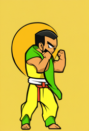 | CHAR-AK-REF | SDXL base 1.0 @4621659840 + VAE fp16-fix @207b116dae + ControlNet OpenPose (xinsir) @23f966cd5c · Google Colab (Tesla T4); torch 2.11.0+cu130, diffusers 0.40.0, transformers 5.18.0 · SDXL: openrail++; VAE: mit; ControlNet: apache-2.0 | **prompt:** flat cel-shaded 2D fighting game sprite, thick dark outline, full body, side view facing right, plain solid green background, stocky cartoon martial artist, big round head, huge cream-wrapped fists, black topknot, cream headband, sleeveless red-orange gi, yellow belt, dark pants, barefoot, fighting stance, fists raised **negative:** realistic, photo, 3d render, gradient background, scenery, floor shadow, text, watermark, signature, logo, extra limbs, extra arms, extra fingers, missing limbs, multiple characters, cropped, out of frame, blood, gore, weapon, checkerboard, transparent background, blurry seed 101 · 832x1216 · 30 steps · cfg 6.0 · EulerDiscreteScheduler · control `design/character/akaken/openpose/01_idle_stance.png` @ 0.9 · 49.9 s to generate | rejected: Zhaohui agreed with Claude's assessment: yellow-green gi, not red-orange (rule 4); no topknot (rule 3); yellow background with a halo, not plain green | — | — |
| `CHAR-AK-REF_s102` 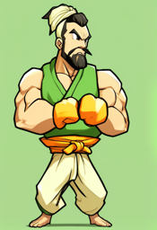 | CHAR-AK-REF | SDXL base 1.0 @4621659840 + VAE fp16-fix @207b116dae + ControlNet OpenPose (xinsir) @23f966cd5c · Google Colab (Tesla T4); torch 2.11.0+cu130, diffusers 0.40.0, transformers 5.18.0 · SDXL: openrail++; VAE: mit; ControlNet: apache-2.0 | **prompt:** flat cel-shaded 2D fighting game sprite, thick dark outline, full body, side view facing right, plain solid green background, stocky cartoon martial artist, big round head, huge cream-wrapped fists, black topknot, cream headband, sleeveless red-orange gi, yellow belt, dark pants, barefoot, fighting stance, fists raised **negative:** realistic, photo, 3d render, gradient background, scenery, floor shadow, text, watermark, signature, logo, extra limbs, extra arms, extra fingers, missing limbs, multiple characters, cropped, out of frame, blood, gore, weapon, checkerboard, transparent background, blurry seed 102 · 832x1216 · 30 steps · cfg 6.0 · EulerDiscreteScheduler · control `design/character/akaken/openpose/01_idle_stance.png` @ 0.9 · 46.3 s to generate | rejected: Zhaohui agreed with Claude's assessment: green vest, not red-orange gi (rule 4); bearded realistic muscleman, not 5-head cartoon (rule 1); arms crossed, ignored the idle skeleton | — | — |
| `CHAR-AK-REF_s103` 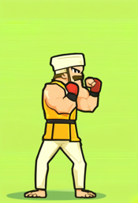 | CHAR-AK-REF | SDXL base 1.0 @4621659840 + VAE fp16-fix @207b116dae + ControlNet OpenPose (xinsir) @23f966cd5c · Google Colab (Tesla T4); torch 2.11.0+cu130, diffusers 0.40.0, transformers 5.18.0 · SDXL: openrail++; VAE: mit; ControlNet: apache-2.0 | **prompt:** flat cel-shaded 2D fighting game sprite, thick dark outline, full body, side view facing right, plain solid green background, stocky cartoon martial artist, big round head, huge cream-wrapped fists, black topknot, cream headband, sleeveless red-orange gi, yellow belt, dark pants, barefoot, fighting stance, fists raised **negative:** realistic, photo, 3d render, gradient background, scenery, floor shadow, text, watermark, signature, logo, extra limbs, extra arms, extra fingers, missing limbs, multiple characters, cropped, out of frame, blood, gore, weapon, checkerboard, transparent background, blurry seed 103 · 832x1216 · 30 steps · cfg 6.0 · EulerDiscreteScheduler · control `design/character/akaken/openpose/01_idle_stance.png` @ 0.9 · 47.6 s to generate | rejected: Zhaohui agreed with Claude's assessment: yellow top and white pants (rule 4); red boxing gloves instead of cream wraps (rule 2); turban and beard instead of topknot + headband (rule 3) | — | — |
| `CHAR-AK-REF_s104` 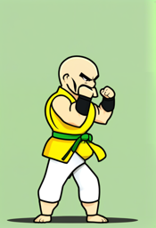 | CHAR-AK-REF | SDXL base 1.0 @4621659840 + VAE fp16-fix @207b116dae + ControlNet OpenPose (xinsir) @23f966cd5c · Google Colab (Tesla T4); torch 2.11.0+cu130, diffusers 0.40.0, transformers 5.18.0 · SDXL: openrail++; VAE: mit; ControlNet: apache-2.0 | **prompt:** flat cel-shaded 2D fighting game sprite, thick dark outline, full body, side view facing right, plain solid green background, stocky cartoon martial artist, big round head, huge cream-wrapped fists, black topknot, cream headband, sleeveless red-orange gi, yellow belt, dark pants, barefoot, fighting stance, fists raised **negative:** realistic, photo, 3d render, gradient background, scenery, floor shadow, text, watermark, signature, logo, extra limbs, extra arms, extra fingers, missing limbs, multiple characters, cropped, out of frame, blood, gore, weapon, checkerboard, transparent background, blurry seed 104 · 832x1216 · 30 steps · cfg 6.0 · EulerDiscreteScheduler · control `design/character/akaken/openpose/01_idle_stance.png` @ 0.9 · 46.8 s to generate | rejected: Zhaohui agreed with Claude's assessment: closest to the skeleton, outline and background, but bald (rule 3) and yellow gi with green belt (rule 4); topknot + headband is what separates Akaken's silhouette from Aotake | — | — |
| `CHAR-AK-REF_s111` 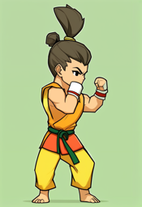 | CHAR-AK-REF | SDXL base 1.0 @4621659840 + VAE fp16-fix @207b116dae + ControlNet OpenPose (xinsir) @23f966cd5c · Google Colab (Tesla T4); torch 2.11.0+cu130, diffusers 0.40.0, transformers 5.18.0 · SDXL: openrail++; VAE: mit; ControlNet: apache-2.0 | **prompt:** flat cel-shaded 2D fighting game sprite, thick dark outline, full body, side view facing right, plain solid green background, red-orange sleeveless gi, young chibi martial artist, big head, black topknot, cream headband, huge cream-wrapped fists, yellow belt, dark pants, barefoot, fighting stance, fists raised **negative:** realistic, photo, 3d render, gradient background, scenery, floor shadow, text, watermark, signature, logo, extra limbs, extra arms, extra fingers, missing limbs, multiple characters, cropped, out of frame, blood, gore, weapon, checkerboard, transparent background, blurry seed 111 · 832x1216 · 30 steps · cfg 6.0 · EulerDiscreteScheduler · control `design/character/akaken/openpose/01_idle_stance.png` @ 0.9 · 49.4 s to generate | rejected: Zhaohui agreed with Claude's assessment: topknot and young face fixed, but no headband (rule 3), yellow pants and green belt (rule 4), small fists (rule 2) | — | — |
| `CHAR-AK-REF_s112` 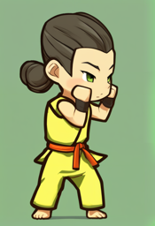 | CHAR-AK-REF | SDXL base 1.0 @4621659840 + VAE fp16-fix @207b116dae + ControlNet OpenPose (xinsir) @23f966cd5c · Google Colab (Tesla T4); torch 2.11.0+cu130, diffusers 0.40.0, transformers 5.18.0 · SDXL: openrail++; VAE: mit; ControlNet: apache-2.0 | **prompt:** flat cel-shaded 2D fighting game sprite, thick dark outline, full body, side view facing right, plain solid green background, red-orange sleeveless gi, young chibi martial artist, big head, black topknot, cream headband, huge cream-wrapped fists, yellow belt, dark pants, barefoot, fighting stance, fists raised **negative:** realistic, photo, 3d render, gradient background, scenery, floor shadow, text, watermark, signature, logo, extra limbs, extra arms, extra fingers, missing limbs, multiple characters, cropped, out of frame, blood, gore, weapon, checkerboard, transparent background, blurry seed 112 · 832x1216 · 30 steps · cfg 6.0 · EulerDiscreteScheduler · control `design/character/akaken/openpose/01_idle_stance.png` @ 0.9 · 46.0 s to generate | rejected: Zhaohui agreed with Claude's assessment: best chibi head, but yellow gi with red belt (rule 4), no headband (rule 3), small dark wraps (rule 2) | — | — |
| `CHAR-AK-REF_s113` 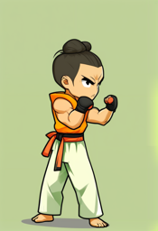 | CHAR-AK-REF | SDXL base 1.0 @4621659840 + VAE fp16-fix @207b116dae + ControlNet OpenPose (xinsir) @23f966cd5c · Google Colab (Tesla T4); torch 2.11.0+cu130, diffusers 0.40.0, transformers 5.18.0 · SDXL: openrail++; VAE: mit; ControlNet: apache-2.0 | **prompt:** flat cel-shaded 2D fighting game sprite, thick dark outline, full body, side view facing right, plain solid green background, red-orange sleeveless gi, young chibi martial artist, big head, black topknot, cream headband, huge cream-wrapped fists, yellow belt, dark pants, barefoot, fighting stance, fists raised **negative:** realistic, photo, 3d render, gradient background, scenery, floor shadow, text, watermark, signature, logo, extra limbs, extra arms, extra fingers, missing limbs, multiple characters, cropped, out of frame, blood, gore, weapon, checkerboard, transparent background, blurry seed 113 · 832x1216 · 30 steps · cfg 6.0 · EulerDiscreteScheduler · control `design/character/akaken/openpose/01_idle_stance.png` @ 0.9 · 47.7 s to generate | rejected: Zhaohui agreed with Claude's assessment: closest so far: red-orange sleeveless top, topknot, follows the skeleton, green background; but white pants, red belt (rule 4) and no headband (rule 3). Kept as fallback for hand edits | — | — |
| `CHAR-AK-REF_s114` 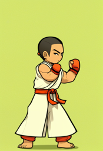 | CHAR-AK-REF | SDXL base 1.0 @4621659840 + VAE fp16-fix @207b116dae + ControlNet OpenPose (xinsir) @23f966cd5c · Google Colab (Tesla T4); torch 2.11.0+cu130, diffusers 0.40.0, transformers 5.18.0 · SDXL: openrail++; VAE: mit; ControlNet: apache-2.0 | **prompt:** flat cel-shaded 2D fighting game sprite, thick dark outline, full body, side view facing right, plain solid green background, red-orange sleeveless gi, young chibi martial artist, big head, black topknot, cream headband, huge cream-wrapped fists, yellow belt, dark pants, barefoot, fighting stance, fists raised **negative:** realistic, photo, 3d render, gradient background, scenery, floor shadow, text, watermark, signature, logo, extra limbs, extra arms, extra fingers, missing limbs, multiple characters, cropped, out of frame, blood, gore, weapon, checkerboard, transparent background, blurry seed 114 · 832x1216 · 30 steps · cfg 6.0 · EulerDiscreteScheduler · control `design/character/akaken/openpose/01_idle_stance.png` @ 0.9 · 46.7 s to generate | rejected: Zhaohui agreed with Claude's assessment: short hair, white robe and red gloves: fails rules 2, 3 and 4 | — | — |
| `CHAR-AK-REF_s121` 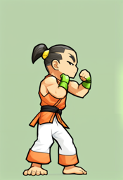 | CHAR-AK-REF | SDXL base 1.0 @4621659840 + VAE fp16-fix @207b116dae + ControlNet OpenPose (xinsir) @23f966cd5c · Google Colab (Tesla T4); torch 2.11.0+cu130, diffusers 0.40.0, transformers 5.18.0 · SDXL: openrail++; VAE: mit; ControlNet: apache-2.0 | **prompt:** flat cel-shaded 2D fighting game sprite, thick dark outline, full body, side view facing right, plain solid green background, white headband tied around forehead, red-orange sleeveless gi, dark pants, young chibi martial artist, big head, black topknot, huge cream-wrapped fists, yellow belt, barefoot, fighting stance, fists raised **negative:** realistic, photo, 3d render, gradient background, scenery, floor shadow, text, watermark, signature, logo, extra limbs, extra arms, extra fingers, missing limbs, multiple characters, cropped, out of frame, blood, gore, weapon, checkerboard, transparent background, blurry seed 121 · 832x1216 · 30 steps · cfg 6.0 · EulerDiscreteScheduler · control `design/character/akaken/openpose/01_idle_stance.png` @ 0.9 · 49.9 s to generate | rejected: Zhaohui agreed with Claude's assessment: topknot and red-orange sleeveless top, side view; but no headband (rule 3), white pants (rule 4), slim not chibi (rule 1) | — | — |
| `CHAR-AK-REF_s122` 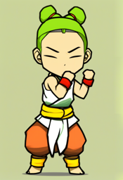 | CHAR-AK-REF | SDXL base 1.0 @4621659840 + VAE fp16-fix @207b116dae + ControlNet OpenPose (xinsir) @23f966cd5c · Google Colab (Tesla T4); torch 2.11.0+cu130, diffusers 0.40.0, transformers 5.18.0 · SDXL: openrail++; VAE: mit; ControlNet: apache-2.0 | **prompt:** flat cel-shaded 2D fighting game sprite, thick dark outline, full body, side view facing right, plain solid green background, white headband tied around forehead, red-orange sleeveless gi, dark pants, young chibi martial artist, big head, black topknot, huge cream-wrapped fists, yellow belt, barefoot, fighting stance, fists raised **negative:** realistic, photo, 3d render, gradient background, scenery, floor shadow, text, watermark, signature, logo, extra limbs, extra arms, extra fingers, missing limbs, multiple characters, cropped, out of frame, blood, gore, weapon, checkerboard, transparent background, blurry seed 122 · 832x1216 · 30 steps · cfg 6.0 · EulerDiscreteScheduler · control `design/character/akaken/openpose/01_idle_stance.png` @ 0.9 · 45.8 s to generate | rejected: Zhaohui agreed with Claude's assessment: green hair in two buns, white top and orange pants: fails rules 3 and 4 | — | — |
| `CHAR-AK-REF_s123` 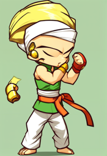 | CHAR-AK-REF | SDXL base 1.0 @4621659840 + VAE fp16-fix @207b116dae + ControlNet OpenPose (xinsir) @23f966cd5c · Google Colab (Tesla T4); torch 2.11.0+cu130, diffusers 0.40.0, transformers 5.18.0 · SDXL: openrail++; VAE: mit; ControlNet: apache-2.0 | **prompt:** flat cel-shaded 2D fighting game sprite, thick dark outline, full body, side view facing right, plain solid green background, white headband tied around forehead, red-orange sleeveless gi, dark pants, young chibi martial artist, big head, black topknot, huge cream-wrapped fists, yellow belt, barefoot, fighting stance, fists raised **negative:** realistic, photo, 3d render, gradient background, scenery, floor shadow, text, watermark, signature, logo, extra limbs, extra arms, extra fingers, missing limbs, multiple characters, cropped, out of frame, blood, gore, weapon, checkerboard, transparent background, blurry seed 123 · 832x1216 · 30 steps · cfg 6.0 · EulerDiscreteScheduler · control `design/character/akaken/openpose/01_idle_stance.png` @ 0.9 · 47.9 s to generate | rejected: Zhaohui agreed with Claude's assessment: 'white headband' became a large turban, green top: fails rules 3 and 4 | — | — |
| `CHAR-AK-REF_s124` 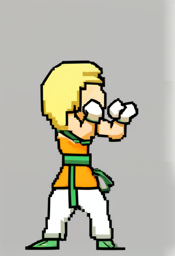 | CHAR-AK-REF | SDXL base 1.0 @4621659840 + VAE fp16-fix @207b116dae + ControlNet OpenPose (xinsir) @23f966cd5c · Google Colab (Tesla T4); torch 2.11.0+cu130, diffusers 0.40.0, transformers 5.18.0 · SDXL: openrail++; VAE: mit; ControlNet: apache-2.0 | **prompt:** flat cel-shaded 2D fighting game sprite, thick dark outline, full body, side view facing right, plain solid green background, white headband tied around forehead, red-orange sleeveless gi, dark pants, young chibi martial artist, big head, black topknot, huge cream-wrapped fists, yellow belt, barefoot, fighting stance, fists raised **negative:** realistic, photo, 3d render, gradient background, scenery, floor shadow, text, watermark, signature, logo, extra limbs, extra arms, extra fingers, missing limbs, multiple characters, cropped, out of frame, blood, gore, weapon, checkerboard, transparent background, blurry seed 124 · 832x1216 · 30 steps · cfg 6.0 · EulerDiscreteScheduler · control `design/character/akaken/openpose/01_idle_stance.png` @ 0.9 · 46.5 s to generate | rejected: Zhaohui agreed with Claude's assessment: blond, pixel-art look and grey background: fails rules 3, 4 and the flat-green background | — | — |
| `CHAR-AK-REF_s131` 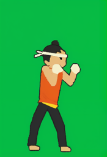 | CHAR-AK-REF | SDXL base 1.0 @4621659840 + VAE fp16-fix @207b116dae + ControlNet OpenPose (xinsir) @23f966cd5c · Google Colab (Tesla T4); torch 2.11.0+cu130, diffusers 0.40.0, transformers 5.18.0 · SDXL: openrail++; VAE: mit; ControlNet: apache-2.0 | **prompt:** flat cel-shaded 2D fighting game sprite, thick dark outline, full body, side view facing right, plain solid green background, white headband tied around forehead, red-orange sleeveless gi, dark pants, young chibi martial artist, big head, black topknot, huge cream-wrapped fists, yellow belt, barefoot, fighting stance, fists raised **negative:** photo, realistic, 3d render, gradient background, scenery, text, watermark, extra limbs, extra fingers, multiple characters, cropped, blood, weapon, checkerboard, blurry, beard, old man, bald, boxing gloves seed 131 · 832x1216 · 30 steps · cfg 6.0 · EulerDiscreteScheduler · control `design/character/akaken/openpose/01_idle_stance.png` @ 0.9 · img2img from `design/character/akaken/colorblock/01_idle_stance.png` @ strength 0.6 · 35.0 s to generate | rejected: Decided by Claude (Zhaohui delegated the choice on 2026-10-05): meets rules 2-4 and follows the skeleton, but at strength 0.6 it is nearly the code-drawn mannequin re-shaded (tube limbs); too little of it is the model's own drawing. Retried at 0.75 | — | — |
| `CHAR-AK-REF_s132` 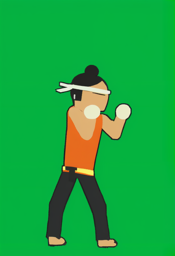 | CHAR-AK-REF | SDXL base 1.0 @4621659840 + VAE fp16-fix @207b116dae + ControlNet OpenPose (xinsir) @23f966cd5c · Google Colab (Tesla T4); torch 2.11.0+cu130, diffusers 0.40.0, transformers 5.18.0 · SDXL: openrail++; VAE: mit; ControlNet: apache-2.0 | **prompt:** flat cel-shaded 2D fighting game sprite, thick dark outline, full body, side view facing right, plain solid green background, white headband tied around forehead, red-orange sleeveless gi, dark pants, young chibi martial artist, big head, black topknot, huge cream-wrapped fists, yellow belt, barefoot, fighting stance, fists raised **negative:** photo, realistic, 3d render, gradient background, scenery, text, watermark, extra limbs, extra fingers, multiple characters, cropped, blood, weapon, checkerboard, blurry, beard, old man, bald, boxing gloves seed 132 · 832x1216 · 30 steps · cfg 6.0 · EulerDiscreteScheduler · control `design/character/akaken/openpose/01_idle_stance.png` @ 0.9 · img2img from `design/character/akaken/colorblock/01_idle_stance.png` @ strength 0.6 · 29.2 s to generate | rejected: Decided by Claude (Zhaohui delegated the choice on 2026-10-05): same as s131: correct colours and headband, but too close to the mannequin at strength 0.6 | — | — |
| `CHAR-AK-REF_s133` 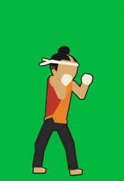 | CHAR-AK-REF | SDXL base 1.0 @4621659840 + VAE fp16-fix @207b116dae + ControlNet OpenPose (xinsir) @23f966cd5c · Google Colab (Tesla T4); torch 2.11.0+cu130, diffusers 0.40.0, transformers 5.18.0 · SDXL: openrail++; VAE: mit; ControlNet: apache-2.0 | **prompt:** flat cel-shaded 2D fighting game sprite, thick dark outline, full body, side view facing right, plain solid green background, white headband tied around forehead, red-orange sleeveless gi, dark pants, young chibi martial artist, big head, black topknot, huge cream-wrapped fists, yellow belt, barefoot, fighting stance, fists raised **negative:** photo, realistic, 3d render, gradient background, scenery, text, watermark, extra limbs, extra fingers, multiple characters, cropped, blood, weapon, checkerboard, blurry, beard, old man, bald, boxing gloves seed 133 · 832x1216 · 30 steps · cfg 6.0 · EulerDiscreteScheduler · control `design/character/akaken/openpose/01_idle_stance.png` @ 0.9 · img2img from `design/character/akaken/colorblock/01_idle_stance.png` @ strength 0.6 · 29.2 s to generate | rejected: Decided by Claude (Zhaohui delegated the choice on 2026-10-05): torso split into a red vest over an orange shirt (rule 4) | — | — |
| `CHAR-AK-REF_s134` 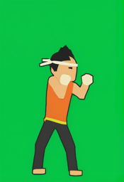 | CHAR-AK-REF | SDXL base 1.0 @4621659840 + VAE fp16-fix @207b116dae + ControlNet OpenPose (xinsir) @23f966cd5c · Google Colab (Tesla T4); torch 2.11.0+cu130, diffusers 0.40.0, transformers 5.18.0 · SDXL: openrail++; VAE: mit; ControlNet: apache-2.0 | **prompt:** flat cel-shaded 2D fighting game sprite, thick dark outline, full body, side view facing right, plain solid green background, white headband tied around forehead, red-orange sleeveless gi, dark pants, young chibi martial artist, big head, black topknot, huge cream-wrapped fists, yellow belt, barefoot, fighting stance, fists raised **negative:** photo, realistic, 3d render, gradient background, scenery, text, watermark, extra limbs, extra fingers, multiple characters, cropped, blood, weapon, checkerboard, blurry, beard, old man, bald, boxing gloves seed 134 · 832x1216 · 30 steps · cfg 6.0 · EulerDiscreteScheduler · control `design/character/akaken/openpose/01_idle_stance.png` @ 0.9 · img2img from `design/character/akaken/colorblock/01_idle_stance.png` @ strength 0.6 · 30.1 s to generate | rejected: Decided by Claude (Zhaohui delegated the choice on 2026-10-05): spiky hair instead of a neat topknot (rule 3) | — | — |
| `CHAR-AK-REF_s141` 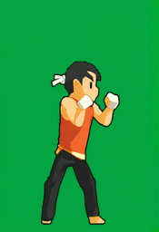 | CHAR-AK-REF | SDXL base 1.0 @4621659840 + VAE fp16-fix @207b116dae + ControlNet OpenPose (xinsir) @23f966cd5c · Google Colab (Tesla T4); torch 2.11.0+cu130, diffusers 0.40.0, transformers 5.18.0 · SDXL: openrail++; VAE: mit; ControlNet: apache-2.0 | **prompt:** flat cel-shaded 2D fighting game sprite, thick dark outline, full body, side view facing right, plain solid green background, white headband tied around forehead, red-orange sleeveless gi, dark pants, young chibi martial artist, big head, black topknot, huge cream-wrapped fists, yellow belt, barefoot, fighting stance, fists raised **negative:** photo, realistic, 3d render, gradient background, scenery, text, watermark, extra limbs, extra fingers, multiple characters, cropped, blood, weapon, checkerboard, blurry, beard, old man, bald, boxing gloves seed 141 · 832x1216 · 30 steps · cfg 6.0 · EulerDiscreteScheduler · control `design/character/akaken/openpose/01_idle_stance.png` @ 0.9 · img2img from `design/character/akaken/colorblock/01_idle_stance.png` @ strength 0.75 · 38.3 s to generate | rejected: Decided by Claude (Zhaohui delegated the choice on 2026-10-05): headband lost (rule 3) | — | — |
| `CHAR-AK-REF_s142` 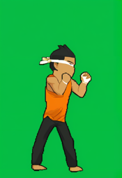 | CHAR-AK-REF | SDXL base 1.0 @4621659840 + VAE fp16-fix @207b116dae + ControlNet OpenPose (xinsir) @23f966cd5c · Google Colab (Tesla T4); torch 2.11.0+cu130, diffusers 0.40.0, transformers 5.18.0 · SDXL: openrail++; VAE: mit; ControlNet: apache-2.0 | **prompt:** flat cel-shaded 2D fighting game sprite, thick dark outline, full body, side view facing right, plain solid green background, white headband tied around forehead, red-orange sleeveless gi, dark pants, young chibi martial artist, big head, black topknot, huge cream-wrapped fists, yellow belt, barefoot, fighting stance, fists raised **negative:** photo, realistic, 3d render, gradient background, scenery, text, watermark, extra limbs, extra fingers, multiple characters, cropped, blood, weapon, checkerboard, blurry, beard, old man, bald, boxing gloves seed 142 · 832x1216 · 30 steps · cfg 6.0 · EulerDiscreteScheduler · control `design/character/akaken/openpose/01_idle_stance.png` @ 0.9 · img2img from `design/character/akaken/colorblock/01_idle_stance.png` @ strength 0.75 · 34.3 s to generate | rejected: Decided by Claude (Zhaohui delegated the choice on 2026-10-05): best face, but spiky hair with no topknot (rule 3) and an extra ornament on the headband | — | — |
| `CHAR-AK-REF_s143` 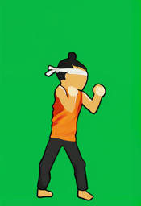 | CHAR-AK-REF | SDXL base 1.0 @4621659840 + VAE fp16-fix @207b116dae + ControlNet OpenPose (xinsir) @23f966cd5c · Google Colab (Tesla T4); torch 2.11.0+cu130, diffusers 0.40.0, transformers 5.18.0 · SDXL: openrail++; VAE: mit; ControlNet: apache-2.0 | **prompt:** flat cel-shaded 2D fighting game sprite, thick dark outline, full body, side view facing right, plain solid green background, white headband tied around forehead, red-orange sleeveless gi, dark pants, young chibi martial artist, big head, black topknot, huge cream-wrapped fists, yellow belt, barefoot, fighting stance, fists raised **negative:** photo, realistic, 3d render, gradient background, scenery, text, watermark, extra limbs, extra fingers, multiple characters, cropped, blood, weapon, checkerboard, blurry, beard, old man, bald, boxing gloves seed 143 · 832x1216 · 30 steps · cfg 6.0 · EulerDiscreteScheduler · control `design/character/akaken/openpose/01_idle_stance.png` @ 0.9 · img2img from `design/character/akaken/colorblock/01_idle_stance.png` @ strength 0.75 · 36.2 s to generate | accepted: Decided by Claude (Zhaohui delegated the choice on 2026-10-05): topknot, white headband with tails, red-orange sleeveless top, dark pants, cream fist wraps, follows the idle skeleton on plain green (rules 2-4, 7). Known flaw: blank face with no eyes; at 112 px the face is ~12 px so it barely reads, noted for the export check | — | IP-Adapter reference for all CHAR-AK poses |
| `CHAR-AK-REF_s144` 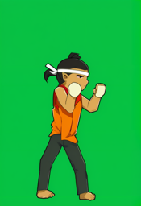 | CHAR-AK-REF | SDXL base 1.0 @4621659840 + VAE fp16-fix @207b116dae + ControlNet OpenPose (xinsir) @23f966cd5c · Google Colab (Tesla T4); torch 2.11.0+cu130, diffusers 0.40.0, transformers 5.18.0 · SDXL: openrail++; VAE: mit; ControlNet: apache-2.0 | **prompt:** flat cel-shaded 2D fighting game sprite, thick dark outline, full body, side view facing right, plain solid green background, white headband tied around forehead, red-orange sleeveless gi, dark pants, young chibi martial artist, big head, black topknot, huge cream-wrapped fists, yellow belt, barefoot, fighting stance, fists raised **negative:** photo, realistic, 3d render, gradient background, scenery, text, watermark, extra limbs, extra fingers, multiple characters, cropped, blood, weapon, checkerboard, blurry, beard, old man, bald, boxing gloves seed 144 · 832x1216 · 30 steps · cfg 6.0 · EulerDiscreteScheduler · control `design/character/akaken/openpose/01_idle_stance.png` @ 0.9 · img2img from `design/character/akaken/colorblock/01_idle_stance.png` @ strength 0.75 · 36.1 s to generate | rejected: Decided by Claude (Zhaohui delegated the choice on 2026-10-05): two-tone torso and one oversized fist (rules 2, 4) | — | — |
| `CHAR-AK-IDLE_s201` 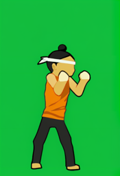 | CHAR-AK-IDLE | SDXL base 1.0 @4621659840 + VAE fp16-fix @207b116dae + ControlNet OpenPose (xinsir) @23f966cd5c + IP-Adapter plus ViT-H @018e402774 · Google Colab (Tesla T4); torch 2.11.0+cu130, diffusers 0.40.0, transformers 5.18.0 · SDXL: openrail++; VAE: mit; ControlNet: apache-2.0; IP-Adapter: apache-2.0 | **prompt:** flat cel-shaded 2D fighting game sprite, thick dark outline, full body, side view facing right, plain solid green background, white headband tied around forehead, red-orange sleeveless gi, dark pants, young chibi martial artist, big head, black topknot, huge cream-wrapped fists, yellow belt, barefoot, fighting stance, fists raised **negative:** photo, realistic, 3d render, gradient background, scenery, text, watermark, extra limbs, extra fingers, multiple characters, cropped, blood, weapon, checkerboard, blurry, beard, old man, bald, boxing gloves seed 201 · 832x1216 · 30 steps · cfg 6.0 · EulerDiscreteScheduler · control `design/character/akaken/openpose/01_idle_stance.png` @ 0.9 · IP ref `raw/CHAR-AK-REF/CHAR-AK-REF_s143.png` @ 0.6 · img2img from `design/character/akaken/colorblock/01_idle_stance.png` @ strength 0.75 · 39.1 s to generate | rejected: Decided by Claude (Zhaohui delegated the choice): palette score 53.7 vs 46.8 for the accepted s202 | — | — |
| `CHAR-AK-IDLE_s202` 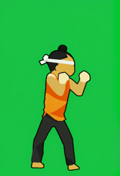 | CHAR-AK-IDLE | SDXL base 1.0 @4621659840 + VAE fp16-fix @207b116dae + ControlNet OpenPose (xinsir) @23f966cd5c + IP-Adapter plus ViT-H @018e402774 · Google Colab (Tesla T4); torch 2.11.0+cu130, diffusers 0.40.0, transformers 5.18.0 · SDXL: openrail++; VAE: mit; ControlNet: apache-2.0; IP-Adapter: apache-2.0 | **prompt:** flat cel-shaded 2D fighting game sprite, thick dark outline, full body, side view facing right, plain solid green background, white headband tied around forehead, red-orange sleeveless gi, dark pants, young chibi martial artist, big head, black topknot, huge cream-wrapped fists, yellow belt, barefoot, fighting stance, fists raised **negative:** photo, realistic, 3d render, gradient background, scenery, text, watermark, extra limbs, extra fingers, multiple characters, cropped, blood, weapon, checkerboard, blurry, beard, old man, bald, boxing gloves seed 202 · 832x1216 · 30 steps · cfg 6.0 · EulerDiscreteScheduler · control `design/character/akaken/openpose/01_idle_stance.png` @ 0.9 · IP ref `raw/CHAR-AK-REF/CHAR-AK-REF_s143.png` @ 0.6 · img2img from `design/character/akaken/colorblock/01_idle_stance.png` @ strength 0.75 · 34.9 s to generate | edited: Decided by Claude (Zhaohui delegated the choice): palette score 46.8 vs 53.7 for s201; headband, topknot, wraps and pose match the sheet. Top drawn lighter orange than #D9482B, as in every pose | rembg isnet-anime background removal; full canvas scaled x0.1296 to 108x158 (LANCZOS) -> godot/art/akaken/idle.png | godot/art/akaken/idle.png |
| `CHAR-AK-WALK_s201` 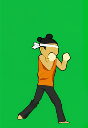 | CHAR-AK-WALK | SDXL base 1.0 @4621659840 + VAE fp16-fix @207b116dae + ControlNet OpenPose (xinsir) @23f966cd5c + IP-Adapter plus ViT-H @018e402774 · Google Colab (Tesla T4); torch 2.11.0+cu130, diffusers 0.40.0, transformers 5.18.0 · SDXL: openrail++; VAE: mit; ControlNet: apache-2.0; IP-Adapter: apache-2.0 | **prompt:** flat cel-shaded 2D fighting game sprite, thick dark outline, full body, side view facing right, plain solid green background, white headband tied around forehead, red-orange sleeveless gi, dark pants, young chibi martial artist, big head, black topknot, huge cream-wrapped fists, yellow belt, barefoot, stepping forward, guard up **negative:** photo, realistic, 3d render, gradient background, scenery, text, watermark, extra limbs, extra fingers, multiple characters, cropped, blood, weapon, checkerboard, blurry, beard, old man, bald, boxing gloves seed 201 · 832x1216 · 30 steps · cfg 6.0 · EulerDiscreteScheduler · control `design/character/akaken/openpose/02_walk_forward.png` @ 0.9 · IP ref `raw/CHAR-AK-REF/CHAR-AK-REF_s143.png` @ 0.6 · img2img from `design/character/akaken/colorblock/02_walk_forward.png` @ strength 0.75 · 36.7 s to generate | rejected: Decided by Claude (Zhaohui delegated the choice): palette score 77.9 vs 46.6 for the accepted s202 (lost the yellow belt) | — | — |
| `CHAR-AK-WALK_s202` 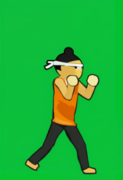 | CHAR-AK-WALK | SDXL base 1.0 @4621659840 + VAE fp16-fix @207b116dae + ControlNet OpenPose (xinsir) @23f966cd5c + IP-Adapter plus ViT-H @018e402774 · Google Colab (Tesla T4); torch 2.11.0+cu130, diffusers 0.40.0, transformers 5.18.0 · SDXL: openrail++; VAE: mit; ControlNet: apache-2.0; IP-Adapter: apache-2.0 | **prompt:** flat cel-shaded 2D fighting game sprite, thick dark outline, full body, side view facing right, plain solid green background, white headband tied around forehead, red-orange sleeveless gi, dark pants, young chibi martial artist, big head, black topknot, huge cream-wrapped fists, yellow belt, barefoot, stepping forward, guard up **negative:** photo, realistic, 3d render, gradient background, scenery, text, watermark, extra limbs, extra fingers, multiple characters, cropped, blood, weapon, checkerboard, blurry, beard, old man, bald, boxing gloves seed 202 · 832x1216 · 30 steps · cfg 6.0 · EulerDiscreteScheduler · control `design/character/akaken/openpose/02_walk_forward.png` @ 0.9 · IP ref `raw/CHAR-AK-REF/CHAR-AK-REF_s143.png` @ 0.6 · img2img from `design/character/akaken/colorblock/02_walk_forward.png` @ strength 0.75 · 36.7 s to generate | edited: Decided by Claude (Zhaohui delegated the choice): palette score 46.6 vs 77.9 for s201; headband, topknot, wraps and pose match the sheet; s201 lost the yellow belt. Top drawn lighter orange than #D9482B, as in every pose | rembg isnet-anime background removal; full canvas scaled x0.1296 to 108x158 (LANCZOS) -> godot/art/akaken/walk.png | godot/art/akaken/walk.png |
| `CHAR-AK-CROUCH_s201` 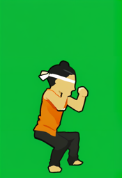 | CHAR-AK-CROUCH | SDXL base 1.0 @4621659840 + VAE fp16-fix @207b116dae + ControlNet OpenPose (xinsir) @23f966cd5c + IP-Adapter plus ViT-H @018e402774 · Google Colab (Tesla T4); torch 2.11.0+cu130, diffusers 0.40.0, transformers 5.18.0 · SDXL: openrail++; VAE: mit; ControlNet: apache-2.0; IP-Adapter: apache-2.0 | **prompt:** flat cel-shaded 2D fighting game sprite, thick dark outline, full body, side view facing right, plain solid green background, white headband tied around forehead, red-orange sleeveless gi, dark pants, young chibi martial artist, big head, black topknot, huge cream-wrapped fists, yellow belt, barefoot, crouching low, guard up **negative:** photo, realistic, 3d render, gradient background, scenery, text, watermark, extra limbs, extra fingers, multiple characters, cropped, blood, weapon, checkerboard, blurry, beard, old man, bald, boxing gloves seed 201 · 832x1216 · 30 steps · cfg 6.0 · EulerDiscreteScheduler · control `design/character/akaken/openpose/03_crouch.png` @ 0.9 · IP ref `raw/CHAR-AK-REF/CHAR-AK-REF_s143.png` @ 0.6 · img2img from `design/character/akaken/colorblock/03_crouch.png` @ strength 0.75 · 36.0 s to generate | edited: Decided by Claude (Zhaohui delegated the choice): palette score 57.2 vs 81.1 for s202; headband, topknot, wraps and pose match the sheet; s202 lost the yellow belt. Top drawn lighter orange than #D9482B, as in every pose | rembg isnet-anime background removal; full canvas scaled x0.1296 to 108x158 (LANCZOS) -> godot/art/akaken/crouch.png | godot/art/akaken/crouch.png |
| `CHAR-AK-CROUCH_s202` 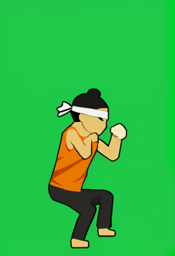 | CHAR-AK-CROUCH | SDXL base 1.0 @4621659840 + VAE fp16-fix @207b116dae + ControlNet OpenPose (xinsir) @23f966cd5c + IP-Adapter plus ViT-H @018e402774 · Google Colab (Tesla T4); torch 2.11.0+cu130, diffusers 0.40.0, transformers 5.18.0 · SDXL: openrail++; VAE: mit; ControlNet: apache-2.0; IP-Adapter: apache-2.0 | **prompt:** flat cel-shaded 2D fighting game sprite, thick dark outline, full body, side view facing right, plain solid green background, white headband tied around forehead, red-orange sleeveless gi, dark pants, young chibi martial artist, big head, black topknot, huge cream-wrapped fists, yellow belt, barefoot, crouching low, guard up **negative:** photo, realistic, 3d render, gradient background, scenery, text, watermark, extra limbs, extra fingers, multiple characters, cropped, blood, weapon, checkerboard, blurry, beard, old man, bald, boxing gloves seed 202 · 832x1216 · 30 steps · cfg 6.0 · EulerDiscreteScheduler · control `design/character/akaken/openpose/03_crouch.png` @ 0.9 · IP ref `raw/CHAR-AK-REF/CHAR-AK-REF_s143.png` @ 0.6 · img2img from `design/character/akaken/colorblock/03_crouch.png` @ strength 0.75 · 36.6 s to generate | rejected: Decided by Claude (Zhaohui delegated the choice): palette score 81.1 vs 57.2 for the accepted s201 (lost the yellow belt) | — | — |
| `CHAR-AK-RISE_s201` 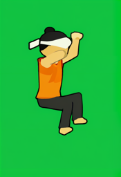 | CHAR-AK-RISE | SDXL base 1.0 @4621659840 + VAE fp16-fix @207b116dae + ControlNet OpenPose (xinsir) @23f966cd5c + IP-Adapter plus ViT-H @018e402774 · Google Colab (Tesla T4); torch 2.11.0+cu130, diffusers 0.40.0, transformers 5.18.0 · SDXL: openrail++; VAE: mit; ControlNet: apache-2.0; IP-Adapter: apache-2.0 | **prompt:** flat cel-shaded 2D fighting game sprite, thick dark outline, full body, side view facing right, plain solid green background, white headband tied around forehead, red-orange sleeveless gi, dark pants, young chibi martial artist, big head, black topknot, huge cream-wrapped fists, yellow belt, barefoot, jumping up, knees tucked **negative:** photo, realistic, 3d render, gradient background, scenery, text, watermark, extra limbs, extra fingers, multiple characters, cropped, blood, weapon, checkerboard, blurry, beard, old man, bald, boxing gloves seed 201 · 832x1216 · 30 steps · cfg 6.0 · EulerDiscreteScheduler · control `design/character/akaken/openpose/04_jump_rising.png` @ 0.9 · IP ref `raw/CHAR-AK-REF/CHAR-AK-REF_s143.png` @ 0.6 · img2img from `design/character/akaken/colorblock/04_jump_rising.png` @ strength 0.75 · 36.3 s to generate | edited: Decided by Claude (Zhaohui delegated the choice): palette score 83.5 vs 86.7 for s202; headband, topknot, wraps and pose match the sheet. Both seeds lost the yellow belt (known flaw). Top drawn lighter orange than #D9482B, as in every pose | rembg isnet-anime background removal; full canvas scaled x0.1296 to 108x158 (LANCZOS) -> godot/art/akaken/rise.png | godot/art/akaken/rise.png |
| `CHAR-AK-RISE_s202` 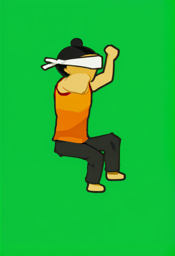 | CHAR-AK-RISE | SDXL base 1.0 @4621659840 + VAE fp16-fix @207b116dae + ControlNet OpenPose (xinsir) @23f966cd5c + IP-Adapter plus ViT-H @018e402774 · Google Colab (Tesla T4); torch 2.11.0+cu130, diffusers 0.40.0, transformers 5.18.0 · SDXL: openrail++; VAE: mit; ControlNet: apache-2.0; IP-Adapter: apache-2.0 | **prompt:** flat cel-shaded 2D fighting game sprite, thick dark outline, full body, side view facing right, plain solid green background, white headband tied around forehead, red-orange sleeveless gi, dark pants, young chibi martial artist, big head, black topknot, huge cream-wrapped fists, yellow belt, barefoot, jumping up, knees tucked **negative:** photo, realistic, 3d render, gradient background, scenery, text, watermark, extra limbs, extra fingers, multiple characters, cropped, blood, weapon, checkerboard, blurry, beard, old man, bald, boxing gloves seed 202 · 832x1216 · 30 steps · cfg 6.0 · EulerDiscreteScheduler · control `design/character/akaken/openpose/04_jump_rising.png` @ 0.9 · IP ref `raw/CHAR-AK-REF/CHAR-AK-REF_s143.png` @ 0.6 · img2img from `design/character/akaken/colorblock/04_jump_rising.png` @ strength 0.75 · 36.2 s to generate | rejected: Decided by Claude (Zhaohui delegated the choice): palette score 86.7 vs 83.5 for the accepted s201 | — | — |
| `CHAR-AK-FALL_s201` 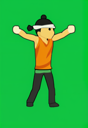 | CHAR-AK-FALL | SDXL base 1.0 @4621659840 + VAE fp16-fix @207b116dae + ControlNet OpenPose (xinsir) @23f966cd5c + IP-Adapter plus ViT-H @018e402774 · Google Colab (Tesla T4); torch 2.11.0+cu130, diffusers 0.40.0, transformers 5.18.0 · SDXL: openrail++; VAE: mit; ControlNet: apache-2.0; IP-Adapter: apache-2.0 | **prompt:** flat cel-shaded 2D fighting game sprite, thick dark outline, full body, side view facing right, plain solid green background, white headband tied around forehead, red-orange sleeveless gi, dark pants, young chibi martial artist, big head, black topknot, huge cream-wrapped fists, yellow belt, barefoot, falling, arms out **negative:** photo, realistic, 3d render, gradient background, scenery, text, watermark, extra limbs, extra fingers, multiple characters, cropped, blood, weapon, checkerboard, blurry, beard, old man, bald, boxing gloves seed 201 · 832x1216 · 30 steps · cfg 6.0 · EulerDiscreteScheduler · control `design/character/akaken/openpose/05_jump_falling.png` @ 0.9 · IP ref `raw/CHAR-AK-REF/CHAR-AK-REF_s143.png` @ 0.6 · img2img from `design/character/akaken/colorblock/05_jump_falling.png` @ strength 0.75 · 36.3 s to generate | edited: Decided by Claude (Zhaohui delegated the choice): palette score 55.5 vs 63.6 for s202; headband, topknot, wraps and pose match the sheet. Top drawn lighter orange than #D9482B, as in every pose | rembg isnet-anime background removal; full canvas scaled x0.1296 to 108x158 (LANCZOS) -> godot/art/akaken/fall.png | godot/art/akaken/fall.png |
| `CHAR-AK-FALL_s202` 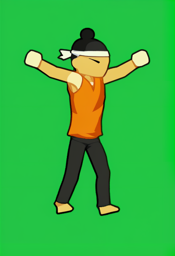 | CHAR-AK-FALL | SDXL base 1.0 @4621659840 + VAE fp16-fix @207b116dae + ControlNet OpenPose (xinsir) @23f966cd5c + IP-Adapter plus ViT-H @018e402774 · Google Colab (Tesla T4); torch 2.11.0+cu130, diffusers 0.40.0, transformers 5.18.0 · SDXL: openrail++; VAE: mit; ControlNet: apache-2.0; IP-Adapter: apache-2.0 | **prompt:** flat cel-shaded 2D fighting game sprite, thick dark outline, full body, side view facing right, plain solid green background, white headband tied around forehead, red-orange sleeveless gi, dark pants, young chibi martial artist, big head, black topknot, huge cream-wrapped fists, yellow belt, barefoot, falling, arms out **negative:** photo, realistic, 3d render, gradient background, scenery, text, watermark, extra limbs, extra fingers, multiple characters, cropped, blood, weapon, checkerboard, blurry, beard, old man, bald, boxing gloves seed 202 · 832x1216 · 30 steps · cfg 6.0 · EulerDiscreteScheduler · control `design/character/akaken/openpose/05_jump_falling.png` @ 0.9 · IP ref `raw/CHAR-AK-REF/CHAR-AK-REF_s143.png` @ 0.6 · img2img from `design/character/akaken/colorblock/05_jump_falling.png` @ strength 0.75 · 36.7 s to generate | rejected: Decided by Claude (Zhaohui delegated the choice): palette score 63.6 vs 55.5 for the accepted s201 | — | — |
| `CHAR-AK-PUNCH_s201` 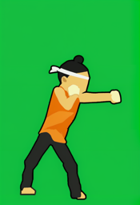 | CHAR-AK-PUNCH | SDXL base 1.0 @4621659840 + VAE fp16-fix @207b116dae + ControlNet OpenPose (xinsir) @23f966cd5c + IP-Adapter plus ViT-H @018e402774 · Google Colab (Tesla T4); torch 2.11.0+cu130, diffusers 0.40.0, transformers 5.18.0 · SDXL: openrail++; VAE: mit; ControlNet: apache-2.0; IP-Adapter: apache-2.0 | **prompt:** flat cel-shaded 2D fighting game sprite, thick dark outline, full body, side view facing right, plain solid green background, white headband tied around forehead, red-orange sleeveless gi, dark pants, young chibi martial artist, big head, black topknot, huge cream-wrapped fists, yellow belt, barefoot, straight punch, arm extended **negative:** photo, realistic, 3d render, gradient background, scenery, text, watermark, extra limbs, extra fingers, multiple characters, cropped, blood, weapon, checkerboard, blurry, beard, old man, bald, boxing gloves seed 201 · 832x1216 · 30 steps · cfg 6.0 · EulerDiscreteScheduler · control `design/character/akaken/openpose/06_punch_jab.png` @ 0.9 · IP ref `raw/CHAR-AK-REF/CHAR-AK-REF_s143.png` @ 0.6 · img2img from `design/character/akaken/colorblock/06_punch_jab.png` @ strength 0.75 · 36.5 s to generate | edited: Decided by Claude (Zhaohui delegated the choice): palette score 47.4 vs 51.8 for s202; headband, topknot, wraps and pose match the sheet. Top drawn lighter orange than #D9482B, as in every pose | rembg isnet-anime background removal; full canvas scaled x0.1296 to 108x158 (LANCZOS) -> godot/art/akaken/punch.png | godot/art/akaken/punch.png |
| `CHAR-AK-PUNCH_s202` 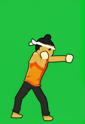 | CHAR-AK-PUNCH | SDXL base 1.0 @4621659840 + VAE fp16-fix @207b116dae + ControlNet OpenPose (xinsir) @23f966cd5c + IP-Adapter plus ViT-H @018e402774 · Google Colab (Tesla T4); torch 2.11.0+cu130, diffusers 0.40.0, transformers 5.18.0 · SDXL: openrail++; VAE: mit; ControlNet: apache-2.0; IP-Adapter: apache-2.0 | **prompt:** flat cel-shaded 2D fighting game sprite, thick dark outline, full body, side view facing right, plain solid green background, white headband tied around forehead, red-orange sleeveless gi, dark pants, young chibi martial artist, big head, black topknot, huge cream-wrapped fists, yellow belt, barefoot, straight punch, arm extended **negative:** photo, realistic, 3d render, gradient background, scenery, text, watermark, extra limbs, extra fingers, multiple characters, cropped, blood, weapon, checkerboard, blurry, beard, old man, bald, boxing gloves seed 202 · 832x1216 · 30 steps · cfg 6.0 · EulerDiscreteScheduler · control `design/character/akaken/openpose/06_punch_jab.png` @ 0.9 · IP ref `raw/CHAR-AK-REF/CHAR-AK-REF_s143.png` @ 0.6 · img2img from `design/character/akaken/colorblock/06_punch_jab.png` @ strength 0.75 · 36.2 s to generate | rejected: Decided by Claude (Zhaohui delegated the choice): palette score 51.8 vs 47.4 for the accepted s201 | — | — |
| `CHAR-AK-KICK_s201` 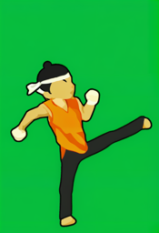 | CHAR-AK-KICK | SDXL base 1.0 @4621659840 + VAE fp16-fix @207b116dae + ControlNet OpenPose (xinsir) @23f966cd5c + IP-Adapter plus ViT-H @018e402774 · Google Colab (Tesla T4); torch 2.11.0+cu130, diffusers 0.40.0, transformers 5.18.0 · SDXL: openrail++; VAE: mit; ControlNet: apache-2.0; IP-Adapter: apache-2.0 | **prompt:** flat cel-shaded 2D fighting game sprite, thick dark outline, full body, side view facing right, plain solid green background, white headband tied around forehead, red-orange sleeveless gi, dark pants, young chibi martial artist, big head, black topknot, huge cream-wrapped fists, yellow belt, barefoot, high kick, leg extended **negative:** photo, realistic, 3d render, gradient background, scenery, text, watermark, extra limbs, extra fingers, multiple characters, cropped, blood, weapon, checkerboard, blurry, beard, old man, bald, boxing gloves seed 201 · 832x1216 · 30 steps · cfg 6.0 · EulerDiscreteScheduler · control `design/character/akaken/openpose/07_high_kick.png` @ 0.9 · IP ref `raw/CHAR-AK-REF/CHAR-AK-REF_s143.png` @ 0.6 · img2img from `design/character/akaken/colorblock/07_high_kick.png` @ strength 0.75 · 36.4 s to generate | edited: Decided by Claude (Zhaohui delegated the choice): palette score 55.8 vs 61.9 for s202; headband, topknot, wraps and pose match the sheet. Top drawn lighter orange than #D9482B, as in every pose | rembg isnet-anime background removal; full canvas scaled x0.1296 to 108x158 (LANCZOS) -> godot/art/akaken/kick.png | godot/art/akaken/kick.png |
| `CHAR-AK-KICK_s202` 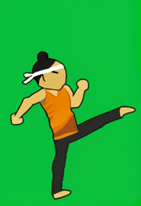 | CHAR-AK-KICK | SDXL base 1.0 @4621659840 + VAE fp16-fix @207b116dae + ControlNet OpenPose (xinsir) @23f966cd5c + IP-Adapter plus ViT-H @018e402774 · Google Colab (Tesla T4); torch 2.11.0+cu130, diffusers 0.40.0, transformers 5.18.0 · SDXL: openrail++; VAE: mit; ControlNet: apache-2.0; IP-Adapter: apache-2.0 | **prompt:** flat cel-shaded 2D fighting game sprite, thick dark outline, full body, side view facing right, plain solid green background, white headband tied around forehead, red-orange sleeveless gi, dark pants, young chibi martial artist, big head, black topknot, huge cream-wrapped fists, yellow belt, barefoot, high kick, leg extended **negative:** photo, realistic, 3d render, gradient background, scenery, text, watermark, extra limbs, extra fingers, multiple characters, cropped, blood, weapon, checkerboard, blurry, beard, old man, bald, boxing gloves seed 202 · 832x1216 · 30 steps · cfg 6.0 · EulerDiscreteScheduler · control `design/character/akaken/openpose/07_high_kick.png` @ 0.9 · IP ref `raw/CHAR-AK-REF/CHAR-AK-REF_s143.png` @ 0.6 · img2img from `design/character/akaken/colorblock/07_high_kick.png` @ strength 0.75 · 36.5 s to generate | rejected: Decided by Claude (Zhaohui delegated the choice): palette score 61.9 vs 55.8 for the accepted s201 | — | — |
| `CHAR-AK-BLOCK_s201` 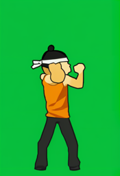 | CHAR-AK-BLOCK | SDXL base 1.0 @4621659840 + VAE fp16-fix @207b116dae + ControlNet OpenPose (xinsir) @23f966cd5c + IP-Adapter plus ViT-H @018e402774 · Google Colab (Tesla T4); torch 2.11.0+cu130, diffusers 0.40.0, transformers 5.18.0 · SDXL: openrail++; VAE: mit; ControlNet: apache-2.0; IP-Adapter: apache-2.0 | **prompt:** flat cel-shaded 2D fighting game sprite, thick dark outline, full body, side view facing right, plain solid green background, white headband tied around forehead, red-orange sleeveless gi, dark pants, young chibi martial artist, big head, black topknot, huge cream-wrapped fists, yellow belt, barefoot, blocking, forearms up **negative:** photo, realistic, 3d render, gradient background, scenery, text, watermark, extra limbs, extra fingers, multiple characters, cropped, blood, weapon, checkerboard, blurry, beard, old man, bald, boxing gloves seed 201 · 832x1216 · 30 steps · cfg 6.0 · EulerDiscreteScheduler · control `design/character/akaken/openpose/08_block.png` @ 0.9 · IP ref `raw/CHAR-AK-REF/CHAR-AK-REF_s143.png` @ 0.6 · img2img from `design/character/akaken/colorblock/08_block.png` @ strength 0.75 · 36.6 s to generate | rejected: Decided by Claude (Zhaohui delegated the choice): palette score 73.5 vs 50.3 for the accepted s202 | — | — |
| `CHAR-AK-BLOCK_s202` 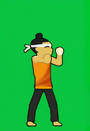 | CHAR-AK-BLOCK | SDXL base 1.0 @4621659840 + VAE fp16-fix @207b116dae + ControlNet OpenPose (xinsir) @23f966cd5c + IP-Adapter plus ViT-H @018e402774 · Google Colab (Tesla T4); torch 2.11.0+cu130, diffusers 0.40.0, transformers 5.18.0 · SDXL: openrail++; VAE: mit; ControlNet: apache-2.0; IP-Adapter: apache-2.0 | **prompt:** flat cel-shaded 2D fighting game sprite, thick dark outline, full body, side view facing right, plain solid green background, white headband tied around forehead, red-orange sleeveless gi, dark pants, young chibi martial artist, big head, black topknot, huge cream-wrapped fists, yellow belt, barefoot, blocking, forearms up **negative:** photo, realistic, 3d render, gradient background, scenery, text, watermark, extra limbs, extra fingers, multiple characters, cropped, blood, weapon, checkerboard, blurry, beard, old man, bald, boxing gloves seed 202 · 832x1216 · 30 steps · cfg 6.0 · EulerDiscreteScheduler · control `design/character/akaken/openpose/08_block.png` @ 0.9 · IP ref `raw/CHAR-AK-REF/CHAR-AK-REF_s143.png` @ 0.6 · img2img from `design/character/akaken/colorblock/08_block.png` @ strength 0.75 · 36.2 s to generate | edited: Decided by Claude (Zhaohui delegated the choice): palette score 50.3 vs 73.5 for s201; headband, topknot, wraps and pose match the sheet. Top drawn lighter orange than #D9482B, as in every pose | rembg isnet-anime background removal; full canvas scaled x0.1296 to 108x158 (LANCZOS) -> godot/art/akaken/block.png | godot/art/akaken/block.png |
| `CHAR-AK-HURT_s201` 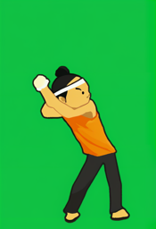 | CHAR-AK-HURT | SDXL base 1.0 @4621659840 + VAE fp16-fix @207b116dae + ControlNet OpenPose (xinsir) @23f966cd5c + IP-Adapter plus ViT-H @018e402774 · Google Colab (Tesla T4); torch 2.11.0+cu130, diffusers 0.40.0, transformers 5.18.0 · SDXL: openrail++; VAE: mit; ControlNet: apache-2.0; IP-Adapter: apache-2.0 | **prompt:** flat cel-shaded 2D fighting game sprite, thick dark outline, full body, side view facing right, plain solid green background, white headband tied around forehead, red-orange sleeveless gi, dark pants, young chibi martial artist, big head, black topknot, huge cream-wrapped fists, yellow belt, barefoot, recoiling from a hit, wincing **negative:** photo, realistic, 3d render, gradient background, scenery, text, watermark, extra limbs, extra fingers, multiple characters, cropped, blood, weapon, checkerboard, blurry, beard, old man, bald, boxing gloves seed 201 · 832x1216 · 30 steps · cfg 6.0 · EulerDiscreteScheduler · control `design/character/akaken/openpose/09_hurt.png` @ 0.9 · IP ref `raw/CHAR-AK-REF/CHAR-AK-REF_s143.png` @ 0.6 · img2img from `design/character/akaken/colorblock/09_hurt.png` @ strength 0.75 · 36.3 s to generate | edited: Decided by Claude (Zhaohui delegated the choice): palette score 55.6 vs 59 for s202; headband, topknot, wraps and pose match the sheet. Top drawn lighter orange than #D9482B, as in every pose | rembg isnet-anime background removal; full canvas scaled x0.1296 to 108x158 (LANCZOS) -> godot/art/akaken/hurt.png | godot/art/akaken/hurt.png |
| `CHAR-AK-HURT_s202` 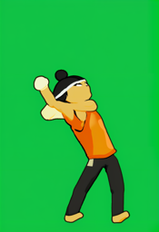 | CHAR-AK-HURT | SDXL base 1.0 @4621659840 + VAE fp16-fix @207b116dae + ControlNet OpenPose (xinsir) @23f966cd5c + IP-Adapter plus ViT-H @018e402774 · Google Colab (Tesla T4); torch 2.11.0+cu130, diffusers 0.40.0, transformers 5.18.0 · SDXL: openrail++; VAE: mit; ControlNet: apache-2.0; IP-Adapter: apache-2.0 | **prompt:** flat cel-shaded 2D fighting game sprite, thick dark outline, full body, side view facing right, plain solid green background, white headband tied around forehead, red-orange sleeveless gi, dark pants, young chibi martial artist, big head, black topknot, huge cream-wrapped fists, yellow belt, barefoot, recoiling from a hit, wincing **negative:** photo, realistic, 3d render, gradient background, scenery, text, watermark, extra limbs, extra fingers, multiple characters, cropped, blood, weapon, checkerboard, blurry, beard, old man, bald, boxing gloves seed 202 · 832x1216 · 30 steps · cfg 6.0 · EulerDiscreteScheduler · control `design/character/akaken/openpose/09_hurt.png` @ 0.9 · IP ref `raw/CHAR-AK-REF/CHAR-AK-REF_s143.png` @ 0.6 · img2img from `design/character/akaken/colorblock/09_hurt.png` @ strength 0.75 · 36.6 s to generate | rejected: Decided by Claude (Zhaohui delegated the choice): palette score 59 vs 55.6 for the accepted s201 | — | — |
| `CHAR-AK-KO_s201` 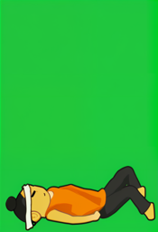 | CHAR-AK-KO | SDXL base 1.0 @4621659840 + VAE fp16-fix @207b116dae + ControlNet OpenPose (xinsir) @23f966cd5c + IP-Adapter plus ViT-H @018e402774 · Google Colab (Tesla T4); torch 2.11.0+cu130, diffusers 0.40.0, transformers 5.18.0 · SDXL: openrail++; VAE: mit; ControlNet: apache-2.0; IP-Adapter: apache-2.0 | **prompt:** flat cel-shaded 2D fighting game sprite, thick dark outline, full body, side view facing right, plain solid green background, white headband tied around forehead, red-orange sleeveless gi, dark pants, young chibi martial artist, big head, black topknot, huge cream-wrapped fists, yellow belt, barefoot, knocked out, lying on back **negative:** photo, realistic, 3d render, gradient background, scenery, text, watermark, extra limbs, extra fingers, multiple characters, cropped, blood, weapon, checkerboard, blurry, beard, old man, bald, boxing gloves seed 201 · 832x1216 · 30 steps · cfg 6.0 · EulerDiscreteScheduler · control `design/character/akaken/openpose/10_ko_down.png` @ 0.9 · IP ref `raw/CHAR-AK-REF/CHAR-AK-REF_s143.png` @ 0.6 · img2img from `design/character/akaken/colorblock/10_ko_down.png` @ strength 0.75 · 36.2 s to generate | edited: Decided by Claude (Zhaohui delegated the choice): palette score 68.6 vs 74.7 for s202; headband, topknot, wraps and pose match the sheet. Top drawn lighter orange than #D9482B, as in every pose | rembg isnet-anime background removal; full canvas scaled x0.1296 to 108x158 (LANCZOS) -> godot/art/akaken/ko.png | godot/art/akaken/ko.png |
| `CHAR-AK-KO_s202` 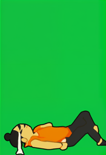 | CHAR-AK-KO | SDXL base 1.0 @4621659840 + VAE fp16-fix @207b116dae + ControlNet OpenPose (xinsir) @23f966cd5c + IP-Adapter plus ViT-H @018e402774 · Google Colab (Tesla T4); torch 2.11.0+cu130, diffusers 0.40.0, transformers 5.18.0 · SDXL: openrail++; VAE: mit; ControlNet: apache-2.0; IP-Adapter: apache-2.0 | **prompt:** flat cel-shaded 2D fighting game sprite, thick dark outline, full body, side view facing right, plain solid green background, white headband tied around forehead, red-orange sleeveless gi, dark pants, young chibi martial artist, big head, black topknot, huge cream-wrapped fists, yellow belt, barefoot, knocked out, lying on back **negative:** photo, realistic, 3d render, gradient background, scenery, text, watermark, extra limbs, extra fingers, multiple characters, cropped, blood, weapon, checkerboard, blurry, beard, old man, bald, boxing gloves seed 202 · 832x1216 · 30 steps · cfg 6.0 · EulerDiscreteScheduler · control `design/character/akaken/openpose/10_ko_down.png` @ 0.9 · IP ref `raw/CHAR-AK-REF/CHAR-AK-REF_s143.png` @ 0.6 · img2img from `design/character/akaken/colorblock/10_ko_down.png` @ strength 0.75 · 36.3 s to generate | rejected: Decided by Claude (Zhaohui delegated the choice): palette score 74.7 vs 68.6 for the accepted s201 | — | — |
| `CHAR-AK-WIN_s201` 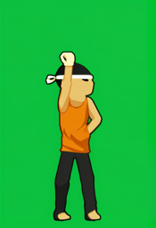 | CHAR-AK-WIN | SDXL base 1.0 @4621659840 + VAE fp16-fix @207b116dae + ControlNet OpenPose (xinsir) @23f966cd5c + IP-Adapter plus ViT-H @018e402774 · Google Colab (Tesla T4); torch 2.11.0+cu130, diffusers 0.40.0, transformers 5.18.0 · SDXL: openrail++; VAE: mit; ControlNet: apache-2.0; IP-Adapter: apache-2.0 | **prompt:** flat cel-shaded 2D fighting game sprite, thick dark outline, full body, side view facing right, plain solid green background, white headband tied around forehead, red-orange sleeveless gi, dark pants, young chibi martial artist, big head, black topknot, huge cream-wrapped fists, yellow belt, barefoot, victory pose, fist raised, smiling **negative:** photo, realistic, 3d render, gradient background, scenery, text, watermark, extra limbs, extra fingers, multiple characters, cropped, blood, weapon, checkerboard, blurry, beard, old man, bald, boxing gloves seed 201 · 832x1216 · 30 steps · cfg 6.0 · EulerDiscreteScheduler · control `design/character/akaken/openpose/11_victory.png` @ 0.9 · IP ref `raw/CHAR-AK-REF/CHAR-AK-REF_s143.png` @ 0.6 · img2img from `design/character/akaken/colorblock/11_victory.png` @ strength 0.75 · 36.4 s to generate | rejected: Decided by Claude (Zhaohui delegated the choice): palette score 64.9 vs 62.4 for the accepted s202 | — | — |
| `CHAR-AK-WIN_s202` 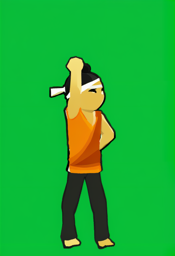 | CHAR-AK-WIN | SDXL base 1.0 @4621659840 + VAE fp16-fix @207b116dae + ControlNet OpenPose (xinsir) @23f966cd5c + IP-Adapter plus ViT-H @018e402774 · Google Colab (Tesla T4); torch 2.11.0+cu130, diffusers 0.40.0, transformers 5.18.0 · SDXL: openrail++; VAE: mit; ControlNet: apache-2.0; IP-Adapter: apache-2.0 | **prompt:** flat cel-shaded 2D fighting game sprite, thick dark outline, full body, side view facing right, plain solid green background, white headband tied around forehead, red-orange sleeveless gi, dark pants, young chibi martial artist, big head, black topknot, huge cream-wrapped fists, yellow belt, barefoot, victory pose, fist raised, smiling **negative:** photo, realistic, 3d render, gradient background, scenery, text, watermark, extra limbs, extra fingers, multiple characters, cropped, blood, weapon, checkerboard, blurry, beard, old man, bald, boxing gloves seed 202 · 832x1216 · 30 steps · cfg 6.0 · EulerDiscreteScheduler · control `design/character/akaken/openpose/11_victory.png` @ 0.9 · IP ref `raw/CHAR-AK-REF/CHAR-AK-REF_s143.png` @ 0.6 · img2img from `design/character/akaken/colorblock/11_victory.png` @ strength 0.75 · 36.6 s to generate | edited: Decided by Claude (Zhaohui delegated the choice): palette score 62.4 vs 64.9 for s201; headband, topknot, wraps and pose match the sheet. Top drawn lighter orange than #D9482B, as in every pose | rembg isnet-anime background removal; full canvas scaled x0.1296 to 108x158 (LANCZOS) -> godot/art/akaken/win.png | godot/art/akaken/win.png |
| `CHAR-AO-REF_s301` 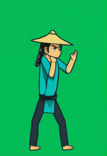 | CHAR-AO-REF | SDXL base 1.0 @4621659840 + VAE fp16-fix @207b116dae + ControlNet OpenPose (xinsir) @23f966cd5c · Google Colab (Tesla T4); torch 2.11.0+cu130, diffusers 0.40.0, transformers 5.18.0 · SDXL: openrail++; VAE: mit; ControlNet: apache-2.0 | **prompt:** flat cel-shaded 2D fighting game sprite, thick dark outline, full body, side view facing right, plain solid green background, tall lean cartoon martial artist, long legs, wide conical straw hat, long black braid, teal robe, navy sash, dark pants, barefoot, calm fighting stance **negative:** photo, realistic, 3d render, gradient background, scenery, text, watermark, extra limbs, extra fingers, multiple characters, cropped, blood, weapon, checkerboard, blurry, beard, old man, bald, boxing gloves seed 301 · 832x1216 · 30 steps · cfg 6.0 · EulerDiscreteScheduler · control `design/character/aotake/openpose/01_idle_stance.png` @ 0.9 · img2img from `design/character/aotake/colorblock/01_idle_stance.png` @ strength 0.75 · 38.2 s to generate | rejected: Decided by Claude (Zhaohui delegated the choice): palette score 50.4 | — | — |
| `CHAR-AO-REF_s302` 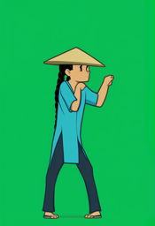 | CHAR-AO-REF | SDXL base 1.0 @4621659840 + VAE fp16-fix @207b116dae + ControlNet OpenPose (xinsir) @23f966cd5c · Google Colab (Tesla T4); torch 2.11.0+cu130, diffusers 0.40.0, transformers 5.18.0 · SDXL: openrail++; VAE: mit; ControlNet: apache-2.0 | **prompt:** flat cel-shaded 2D fighting game sprite, thick dark outline, full body, side view facing right, plain solid green background, tall lean cartoon martial artist, long legs, wide conical straw hat, long black braid, teal robe, navy sash, dark pants, barefoot, calm fighting stance **negative:** photo, realistic, 3d render, gradient background, scenery, text, watermark, extra limbs, extra fingers, multiple characters, cropped, blood, weapon, checkerboard, blurry, beard, old man, bald, boxing gloves seed 302 · 832x1216 · 30 steps · cfg 6.0 · EulerDiscreteScheduler · control `design/character/aotake/openpose/01_idle_stance.png` @ 0.9 · img2img from `design/character/aotake/colorblock/01_idle_stance.png` @ strength 0.75 · 34.9 s to generate | rejected: Decided by Claude (Zhaohui delegated the choice): palette score 66.3, robe and skin furthest from the sheet | — | — |
| `CHAR-AO-REF_s303` 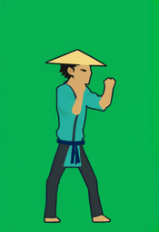 | CHAR-AO-REF | SDXL base 1.0 @4621659840 + VAE fp16-fix @207b116dae + ControlNet OpenPose (xinsir) @23f966cd5c · Google Colab (Tesla T4); torch 2.11.0+cu130, diffusers 0.40.0, transformers 5.18.0 · SDXL: openrail++; VAE: mit; ControlNet: apache-2.0 | **prompt:** flat cel-shaded 2D fighting game sprite, thick dark outline, full body, side view facing right, plain solid green background, tall lean cartoon martial artist, long legs, wide conical straw hat, long black braid, teal robe, navy sash, dark pants, barefoot, calm fighting stance **negative:** photo, realistic, 3d render, gradient background, scenery, text, watermark, extra limbs, extra fingers, multiple characters, cropped, blood, weapon, checkerboard, blurry, beard, old man, bald, boxing gloves seed 303 · 832x1216 · 30 steps · cfg 6.0 · EulerDiscreteScheduler · control `design/character/aotake/openpose/01_idle_stance.png` @ 0.9 · img2img from `design/character/aotake/colorblock/01_idle_stance.png` @ strength 0.75 · 35.9 s to generate | accepted: Decided by Claude (Zhaohui delegated the choice): palette score 43.9 (best of 4); straw hat wider than the shoulders, braid, teal robe, navy sash, dark pants, follows the idle skeleton (sheet appendix) | — | IP-Adapter reference for all CHAR-AO poses |
| `CHAR-AO-REF_s304` 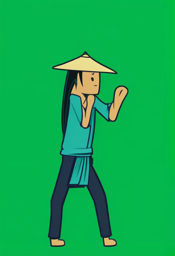 | CHAR-AO-REF | SDXL base 1.0 @4621659840 + VAE fp16-fix @207b116dae + ControlNet OpenPose (xinsir) @23f966cd5c · Google Colab (Tesla T4); torch 2.11.0+cu130, diffusers 0.40.0, transformers 5.18.0 · SDXL: openrail++; VAE: mit; ControlNet: apache-2.0 | **prompt:** flat cel-shaded 2D fighting game sprite, thick dark outline, full body, side view facing right, plain solid green background, tall lean cartoon martial artist, long legs, wide conical straw hat, long black braid, teal robe, navy sash, dark pants, barefoot, calm fighting stance **negative:** photo, realistic, 3d render, gradient background, scenery, text, watermark, extra limbs, extra fingers, multiple characters, cropped, blood, weapon, checkerboard, blurry, beard, old man, bald, boxing gloves seed 304 · 832x1216 · 30 steps · cfg 6.0 · EulerDiscreteScheduler · control `design/character/aotake/openpose/01_idle_stance.png` @ 0.9 · img2img from `design/character/aotake/colorblock/01_idle_stance.png` @ strength 0.75 · 35.9 s to generate | rejected: Decided by Claude (Zhaohui delegated the choice): palette score 45.6, close second; s303 chosen | — | — |
| `CHAR-AO-IDLE_s401` 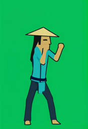 | CHAR-AO-IDLE | SDXL base 1.0 @4621659840 + VAE fp16-fix @207b116dae + ControlNet OpenPose (xinsir) @23f966cd5c + IP-Adapter plus ViT-H @018e402774 · Google Colab (Tesla T4); torch 2.11.0+cu130, diffusers 0.40.0, transformers 5.18.0 · SDXL: openrail++; VAE: mit; ControlNet: apache-2.0; IP-Adapter: apache-2.0 | **prompt:** flat cel-shaded 2D fighting game sprite, thick dark outline, full body, side view facing right, plain solid green background, tall lean cartoon martial artist, long legs, wide conical straw hat, long black braid, teal robe, navy sash, dark pants, barefoot, calm fighting stance **negative:** photo, realistic, 3d render, gradient background, scenery, text, watermark, extra limbs, extra fingers, multiple characters, cropped, blood, weapon, checkerboard, blurry, beard, old man, bald, boxing gloves seed 401 · 832x1216 · 30 steps · cfg 6.0 · EulerDiscreteScheduler · control `design/character/aotake/openpose/01_idle_stance.png` @ 0.9 · IP ref `raw/CHAR-AO-REF/CHAR-AO-REF_s303.png` @ 0.6 · img2img from `design/character/aotake/colorblock/01_idle_stance.png` @ strength 0.75 · 38.9 s to generate | edited: Decided by Claude (Zhaohui delegated the choice): palette score 40.8 vs 44; hat, braid, teal robe and sash kept from the reference; anatomy spot-checked only | rembg isnet-anime background removal; full canvas scaled x0.136 to 113x165 (LANCZOS) -> godot/art/aotake/idle.png | godot/art/aotake/idle.png |
| `CHAR-AO-IDLE_s402` 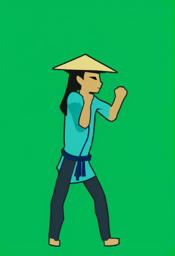 | CHAR-AO-IDLE | SDXL base 1.0 @4621659840 + VAE fp16-fix @207b116dae + ControlNet OpenPose (xinsir) @23f966cd5c + IP-Adapter plus ViT-H @018e402774 · Google Colab (Tesla T4); torch 2.11.0+cu130, diffusers 0.40.0, transformers 5.18.0 · SDXL: openrail++; VAE: mit; ControlNet: apache-2.0; IP-Adapter: apache-2.0 | **prompt:** flat cel-shaded 2D fighting game sprite, thick dark outline, full body, side view facing right, plain solid green background, tall lean cartoon martial artist, long legs, wide conical straw hat, long black braid, teal robe, navy sash, dark pants, barefoot, calm fighting stance **negative:** photo, realistic, 3d render, gradient background, scenery, text, watermark, extra limbs, extra fingers, multiple characters, cropped, blood, weapon, checkerboard, blurry, beard, old man, bald, boxing gloves seed 402 · 832x1216 · 30 steps · cfg 6.0 · EulerDiscreteScheduler · control `design/character/aotake/openpose/01_idle_stance.png` @ 0.9 · IP ref `raw/CHAR-AO-REF/CHAR-AO-REF_s303.png` @ 0.6 · img2img from `design/character/aotake/colorblock/01_idle_stance.png` @ strength 0.75 · 35.1 s to generate | rejected: Decided by Claude (Zhaohui delegated the choice): palette score 44 vs 40.8 for the accepted s401 | — | — |
| `CHAR-AO-KICK_s401` 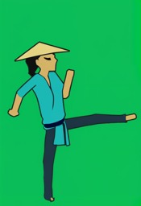 | CHAR-AO-KICK | SDXL base 1.0 @4621659840 + VAE fp16-fix @207b116dae + ControlNet OpenPose (xinsir) @23f966cd5c + IP-Adapter plus ViT-H @018e402774 · Google Colab (Tesla T4); torch 2.11.0+cu130, diffusers 0.40.0, transformers 5.18.0 · SDXL: openrail++; VAE: mit; ControlNet: apache-2.0; IP-Adapter: apache-2.0 | **prompt:** flat cel-shaded 2D fighting game sprite, thick dark outline, full body, side view facing right, plain solid green background, tall lean cartoon martial artist, long legs, wide conical straw hat, long black braid, teal robe, navy sash, dark pants, barefoot, front kick, leg extended **negative:** photo, realistic, 3d render, gradient background, scenery, text, watermark, extra limbs, extra fingers, multiple characters, cropped, blood, weapon, checkerboard, blurry, beard, old man, bald, boxing gloves seed 401 · 832x1216 · 30 steps · cfg 6.0 · EulerDiscreteScheduler · control `design/character/aotake/openpose/02_front_kick.png` @ 0.9 · IP ref `raw/CHAR-AO-REF/CHAR-AO-REF_s303.png` @ 0.6 · img2img from `design/character/aotake/colorblock/02_front_kick.png` @ strength 0.75 · 36.7 s to generate | edited: Decided by Claude (Zhaohui delegated the choice): palette score 46.3 vs 47.9; hat, braid, teal robe and sash kept from the reference; anatomy spot-checked only | rembg isnet-anime background removal; full canvas scaled x0.136 to 113x165 (LANCZOS) -> godot/art/aotake/kick.png | godot/art/aotake/kick.png |
| `CHAR-AO-KICK_s402` 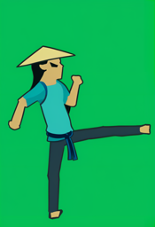 | CHAR-AO-KICK | SDXL base 1.0 @4621659840 + VAE fp16-fix @207b116dae + ControlNet OpenPose (xinsir) @23f966cd5c + IP-Adapter plus ViT-H @018e402774 · Google Colab (Tesla T4); torch 2.11.0+cu130, diffusers 0.40.0, transformers 5.18.0 · SDXL: openrail++; VAE: mit; ControlNet: apache-2.0; IP-Adapter: apache-2.0 | **prompt:** flat cel-shaded 2D fighting game sprite, thick dark outline, full body, side view facing right, plain solid green background, tall lean cartoon martial artist, long legs, wide conical straw hat, long black braid, teal robe, navy sash, dark pants, barefoot, front kick, leg extended **negative:** photo, realistic, 3d render, gradient background, scenery, text, watermark, extra limbs, extra fingers, multiple characters, cropped, blood, weapon, checkerboard, blurry, beard, old man, bald, boxing gloves seed 402 · 832x1216 · 30 steps · cfg 6.0 · EulerDiscreteScheduler · control `design/character/aotake/openpose/02_front_kick.png` @ 0.9 · IP ref `raw/CHAR-AO-REF/CHAR-AO-REF_s303.png` @ 0.6 · img2img from `design/character/aotake/colorblock/02_front_kick.png` @ strength 0.75 · 36.8 s to generate | rejected: Decided by Claude (Zhaohui delegated the choice): palette score 47.9 vs 46.3 for the accepted s401 | — | — |
| `CHAR-AO-BLOCK_s401`  | CHAR-AO-BLOCK | SDXL base 1.0 @4621659840 + VAE fp16-fix @207b116dae + ControlNet OpenPose (xinsir) @23f966cd5c + IP-Adapter plus ViT-H @018e402774 · Google Colab (Tesla T4); torch 2.11.0+cu130, diffusers 0.40.0, transformers 5.18.0 · SDXL: openrail++; VAE: mit; ControlNet: apache-2.0; IP-Adapter: apache-2.0 | **prompt:** flat cel-shaded 2D fighting game sprite, thick dark outline, full body, side view facing right, plain solid green background, tall lean cartoon martial artist, long legs, wide conical straw hat, long black braid, teal robe, navy sash, dark pants, barefoot, blocking, forearms up **negative:** photo, realistic, 3d render, gradient background, scenery, text, watermark, extra limbs, extra fingers, multiple characters, cropped, blood, weapon, checkerboard, blurry, beard, old man, bald, boxing gloves seed 401 · 832x1216 · 30 steps · cfg 6.0 · EulerDiscreteScheduler · control `design/character/aotake/openpose/03_block.png` @ 0.9 · IP ref `raw/CHAR-AO-REF/CHAR-AO-REF_s303.png` @ 0.6 · img2img from `design/character/aotake/colorblock/03_block.png` @ strength 0.75 · 35.9 s to generate | rejected: Decided by Claude (Zhaohui delegated the choice): palette score 48.5 vs 40 for the accepted s402 | — | — |
| `CHAR-AO-BLOCK_s402`  | CHAR-AO-BLOCK | SDXL base 1.0 @4621659840 + VAE fp16-fix @207b116dae + ControlNet OpenPose (xinsir) @23f966cd5c + IP-Adapter plus ViT-H @018e402774 · Google Colab (Tesla T4); torch 2.11.0+cu130, diffusers 0.40.0, transformers 5.18.0 · SDXL: openrail++; VAE: mit; ControlNet: apache-2.0; IP-Adapter: apache-2.0 | **prompt:** flat cel-shaded 2D fighting game sprite, thick dark outline, full body, side view facing right, plain solid green background, tall lean cartoon martial artist, long legs, wide conical straw hat, long black braid, teal robe, navy sash, dark pants, barefoot, blocking, forearms up **negative:** photo, realistic, 3d render, gradient background, scenery, text, watermark, extra limbs, extra fingers, multiple characters, cropped, blood, weapon, checkerboard, blurry, beard, old man, bald, boxing gloves seed 402 · 832x1216 · 30 steps · cfg 6.0 · EulerDiscreteScheduler · control `design/character/aotake/openpose/03_block.png` @ 0.9 · IP ref `raw/CHAR-AO-REF/CHAR-AO-REF_s303.png` @ 0.6 · img2img from `design/character/aotake/colorblock/03_block.png` @ strength 0.75 · 36.5 s to generate | edited: Decided by Claude (Zhaohui delegated the choice): palette score 40 vs 48.5; hat, braid, teal robe and sash kept from the reference; anatomy spot-checked only | rembg isnet-anime background removal; full canvas scaled x0.136 to 113x165 (LANCZOS) -> godot/art/aotake/block.png | godot/art/aotake/block.png |
| `CHAR-AO-HURT_s401`  | CHAR-AO-HURT | SDXL base 1.0 @4621659840 + VAE fp16-fix @207b116dae + ControlNet OpenPose (xinsir) @23f966cd5c + IP-Adapter plus ViT-H @018e402774 · Google Colab (Tesla T4); torch 2.11.0+cu130, diffusers 0.40.0, transformers 5.18.0 · SDXL: openrail++; VAE: mit; ControlNet: apache-2.0; IP-Adapter: apache-2.0 | **prompt:** flat cel-shaded 2D fighting game sprite, thick dark outline, full body, side view facing right, plain solid green background, tall lean cartoon martial artist, long legs, wide conical straw hat, long black braid, teal robe, navy sash, dark pants, barefoot, recoiling from a hit, wincing **negative:** photo, realistic, 3d render, gradient background, scenery, text, watermark, extra limbs, extra fingers, multiple characters, cropped, blood, weapon, checkerboard, blurry, beard, old man, bald, boxing gloves seed 401 · 832x1216 · 30 steps · cfg 6.0 · EulerDiscreteScheduler · control `design/character/aotake/openpose/04_hurt.png` @ 0.9 · IP ref `raw/CHAR-AO-REF/CHAR-AO-REF_s303.png` @ 0.6 · img2img from `design/character/aotake/colorblock/04_hurt.png` @ strength 0.75 · 36.5 s to generate | rejected: Decided by Claude (Zhaohui delegated the choice): palette score 52.4 vs 51.7 for the accepted s402 | — | — |
| `CHAR-AO-HURT_s402`  | CHAR-AO-HURT | SDXL base 1.0 @4621659840 + VAE fp16-fix @207b116dae + ControlNet OpenPose (xinsir) @23f966cd5c + IP-Adapter plus ViT-H @018e402774 · Google Colab (Tesla T4); torch 2.11.0+cu130, diffusers 0.40.0, transformers 5.18.0 · SDXL: openrail++; VAE: mit; ControlNet: apache-2.0; IP-Adapter: apache-2.0 | **prompt:** flat cel-shaded 2D fighting game sprite, thick dark outline, full body, side view facing right, plain solid green background, tall lean cartoon martial artist, long legs, wide conical straw hat, long black braid, teal robe, navy sash, dark pants, barefoot, recoiling from a hit, wincing **negative:** photo, realistic, 3d render, gradient background, scenery, text, watermark, extra limbs, extra fingers, multiple characters, cropped, blood, weapon, checkerboard, blurry, beard, old man, bald, boxing gloves seed 402 · 832x1216 · 30 steps · cfg 6.0 · EulerDiscreteScheduler · control `design/character/aotake/openpose/04_hurt.png` @ 0.9 · IP ref `raw/CHAR-AO-REF/CHAR-AO-REF_s303.png` @ 0.6 · img2img from `design/character/aotake/colorblock/04_hurt.png` @ strength 0.75 · 36.5 s to generate | edited: Decided by Claude (Zhaohui delegated the choice): palette score 51.7 vs 52.4; hat, braid, teal robe and sash kept from the reference; anatomy spot-checked only | rembg isnet-anime background removal; full canvas scaled x0.136 to 113x165 (LANCZOS) -> godot/art/aotake/hurt.png | godot/art/aotake/hurt.png |
| `CHAR-AO-KO_s401`  | CHAR-AO-KO | SDXL base 1.0 @4621659840 + VAE fp16-fix @207b116dae + ControlNet OpenPose (xinsir) @23f966cd5c + IP-Adapter plus ViT-H @018e402774 · Google Colab (Tesla T4); torch 2.11.0+cu130, diffusers 0.40.0, transformers 5.18.0 · SDXL: openrail++; VAE: mit; ControlNet: apache-2.0; IP-Adapter: apache-2.0 | **prompt:** flat cel-shaded 2D fighting game sprite, thick dark outline, full body, side view facing right, plain solid green background, tall lean cartoon martial artist, long legs, wide conical straw hat, long black braid, teal robe, navy sash, dark pants, barefoot, knocked out, lying on back, hat beside head **negative:** photo, realistic, 3d render, gradient background, scenery, text, watermark, extra limbs, extra fingers, multiple characters, cropped, blood, weapon, checkerboard, blurry, beard, old man, bald, boxing gloves seed 401 · 832x1216 · 30 steps · cfg 6.0 · EulerDiscreteScheduler · control `design/character/aotake/openpose/05_ko_down.png` @ 0.9 · IP ref `raw/CHAR-AO-REF/CHAR-AO-REF_s303.png` @ 0.6 · img2img from `design/character/aotake/colorblock/05_ko_down.png` @ strength 0.75 · 36.4 s to generate | edited: Decided by Claude (Zhaohui delegated the choice): palette score 46.8 vs 67.7; hat, braid, teal robe and sash kept from the reference; anatomy spot-checked only | rembg isnet-anime background removal; full canvas scaled x0.136 to 113x165 (LANCZOS) -> godot/art/aotake/ko.png; re-exported: rembg isnet-anime had erased the lying pose (2 opaque px); green chroma key (margin 40, spill suppressed); full canvas scaled x0.136 to 113x165 (LANCZOS) -> godot/art/aotake/ko.png; 2390 opaque px | godot/art/aotake/ko.png |
| `CHAR-AO-KO_s402`  | CHAR-AO-KO | SDXL base 1.0 @4621659840 + VAE fp16-fix @207b116dae + ControlNet OpenPose (xinsir) @23f966cd5c + IP-Adapter plus ViT-H @018e402774 · Google Colab (Tesla T4); torch 2.11.0+cu130, diffusers 0.40.0, transformers 5.18.0 · SDXL: openrail++; VAE: mit; ControlNet: apache-2.0; IP-Adapter: apache-2.0 | **prompt:** flat cel-shaded 2D fighting game sprite, thick dark outline, full body, side view facing right, plain solid green background, tall lean cartoon martial artist, long legs, wide conical straw hat, long black braid, teal robe, navy sash, dark pants, barefoot, knocked out, lying on back, hat beside head **negative:** photo, realistic, 3d render, gradient background, scenery, text, watermark, extra limbs, extra fingers, multiple characters, cropped, blood, weapon, checkerboard, blurry, beard, old man, bald, boxing gloves seed 402 · 832x1216 · 30 steps · cfg 6.0 · EulerDiscreteScheduler · control `design/character/aotake/openpose/05_ko_down.png` @ 0.9 · IP ref `raw/CHAR-AO-REF/CHAR-AO-REF_s303.png` @ 0.6 · img2img from `design/character/aotake/colorblock/05_ko_down.png` @ strength 0.75 · 36.5 s to generate | rejected: Decided by Claude (Zhaohui delegated the choice): palette score 67.7 vs 46.8 for the accepted s401 | — | — |
| `ENV-BG_s501`  | ENV-BG | SDXL base 1.0 @4621659840 + VAE fp16-fix @207b116dae · Google Colab (Tesla T4); torch 2.11.0+cu130, diffusers 0.40.0, transformers 5.18.0 · SDXL: openrail++; VAE: mit | **prompt:** flat cel-shaded 2D fighting game stage background, side view, empty stone temple courtyard at dusk, dark purple-grey wall across the middle, glowing orange paper lanterns left and right, purple dusk sky, dark stone floor, no people **negative:** people, person, character, animal, text, watermark, logo, photo, realistic, busy details, high contrast, bright wall, perspective floor grid seed 501 · 1344x768 · 30 steps · cfg 6.0 · EulerDiscreteScheduler · 50.6 s to generate | edited: Decided by Claude (Zhaohui delegated the choice): darkest and least busy band behind the fighters (luminance 0.084, std 0.088) and best red-gi contrast (1.83) of the four; still brighter than the sheet's planned wall, so darkened on export | resized 1344x768 -> 640x360 (LANCZOS); brightness x0.7 so the fighters' band (y 100-305) drops from luminance 0.085 to 0.040, red gi contrast 1.83 -> 2.72, teal robe 3.87 -> godot/art/env/bg.png | godot/art/env/bg.png (all panels) |
| `ENV-BG_s502`  | ENV-BG | SDXL base 1.0 @4621659840 + VAE fp16-fix @207b116dae · Google Colab (Tesla T4); torch 2.11.0+cu130, diffusers 0.40.0, transformers 5.18.0 · SDXL: openrail++; VAE: mit | **prompt:** flat cel-shaded 2D fighting game stage background, side view, empty stone temple courtyard at dusk, dark purple-grey wall across the middle, glowing orange paper lanterns left and right, purple dusk sky, dark stone floor, no people **negative:** people, person, character, animal, text, watermark, logo, photo, realistic, busy details, high contrast, bright wall, perspective floor grid seed 502 · 1344x768 · 30 steps · cfg 6.0 · EulerDiscreteScheduler · 46.7 s to generate | rejected: Decided by Claude (Zhaohui delegated the choice): brighter band (0.123), red gi contrast 1.42; bright sun behind the fighters | — | — |
| `ENV-BG_s503`  | ENV-BG | SDXL base 1.0 @4621659840 + VAE fp16-fix @207b116dae · Google Colab (Tesla T4); torch 2.11.0+cu130, diffusers 0.40.0, transformers 5.18.0 · SDXL: openrail++; VAE: mit | **prompt:** flat cel-shaded 2D fighting game stage background, side view, empty stone temple courtyard at dusk, dark purple-grey wall across the middle, glowing orange paper lanterns left and right, purple dusk sky, dark stone floor, no people **negative:** people, person, character, animal, text, watermark, logo, photo, realistic, busy details, high contrast, bright wall, perspective floor grid seed 503 · 1344x768 · 30 steps · cfg 6.0 · EulerDiscreteScheduler · 48.4 s to generate | rejected: Decided by Claude (Zhaohui delegated the choice): busiest band (std 0.127) with a bright gateway where the fighters stand | — | — |
| `ENV-BG_s504`  | ENV-BG | SDXL base 1.0 @4621659840 + VAE fp16-fix @207b116dae · Google Colab (Tesla T4); torch 2.11.0+cu130, diffusers 0.40.0, transformers 5.18.0 · SDXL: openrail++; VAE: mit | **prompt:** flat cel-shaded 2D fighting game stage background, side view, empty stone temple courtyard at dusk, dark purple-grey wall across the middle, glowing orange paper lanterns left and right, purple dusk sky, dark stone floor, no people **negative:** people, person, character, animal, text, watermark, logo, photo, realistic, busy details, high contrast, bright wall, perspective floor grid seed 504 · 1344x768 · 30 steps · cfg 6.0 · EulerDiscreteScheduler · 47.5 s to generate | rejected: Decided by Claude (Zhaohui delegated the choice): band 0.104, red contrast 1.60, lanterns scattered through the fighters' band | — | — |
| `MUS-RAW_s21`  | MUS-RAW | MusicGen medium @d3bd7b0076 · Google Colab (Tesla T4); torch 2.11.0+cu130, diffusers 0.41.0, transformers 5.19.0 · MusicGen weights: cc-by-nc-4.0 | **prompt:** calm ceremonial temple music at dusk, slow steady taiko drum pulse, airy bamboo flute melody, sparse wooden percussion, focused and tense but quiet, 80 bpm, 4/4, instrumental, no vocals seed 21 · 29.94 s @ 32000 Hz · 1500 steps · cfg 3.0 · sampling top_k=250 temperature=1.0 · 123.5 s to generate | rejected: Decided by Claude from the objective checks above (Zhaohui delegated the choice; re-judge by ear): the music stops at about 20 s (7 s below -30 dB) and loudness swings 21.9 dB; no steady 8-bar span | — | — |
| `MUS-RAW_s22`  | MUS-RAW | MusicGen medium @d3bd7b0076 · Google Colab (Tesla T4); torch 2.11.0+cu130, diffusers 0.41.0, transformers 5.19.0 · MusicGen weights: cc-by-nc-4.0 | **prompt:** calm ceremonial temple music at dusk, slow steady taiko drum pulse, airy bamboo flute melody, sparse wooden percussion, focused and tense but quiet, 80 bpm, 4/4, instrumental, no vocals seed 22 · 29.94 s @ 32000 Hz · 1500 steps · cfg 3.0 · sampling top_k=250 temperature=1.0 · 115.3 s to generate | edited: Decided by Claude from the objective checks above (Zhaohui delegated the choice; re-judge by ear): tracked 79.8 bpm against the 80 asked, beat spacing spread 1.0 %, 1 s loudness spread 0.9 dB, no quiet stretch; steadiest of the three, which the bar-cut loop depends on | loop cut 8 bars at detected 79.8 bpm, 2.017-26.017 s (24.0 s), cut points snapped to zero crossings, 40 ms tail-to-head crossfade, peak -1 dBFS (decoded -1.32 dBFS, -0.3 dB correction); seam score 8.8 -> 15.8; Godot loops the OGG (AudioDirector sets loop = true) -> godot/audio/music/loop.ogg | godot/audio/music/loop.ogg (AudioDirector, panels 1-5, 7) |
| `MUS-RAW_s23`  | MUS-RAW | MusicGen medium @d3bd7b0076 · Google Colab (Tesla T4); torch 2.11.0+cu130, diffusers 0.41.0, transformers 5.19.0 · MusicGen weights: cc-by-nc-4.0 | **prompt:** calm ceremonial temple music at dusk, slow steady taiko drum pulse, airy bamboo flute melody, sparse wooden percussion, focused and tense but quiet, 80 bpm, 4/4, instrumental, no vocals seed 23 · 29.94 s @ 32000 Hz · 1500 steps · cfg 3.0 · sampling top_k=250 temperature=1.0 · 115.1 s to generate | rejected: Decided by Claude from the objective checks above (Zhaohui delegated the choice; re-judge by ear): tracked 163 bpm, double the 80 asked, and beat spacing spread 3.3 %; loudest (-15.9 dB mean), busier than the calm Dusk ritual pillar | — | — |
