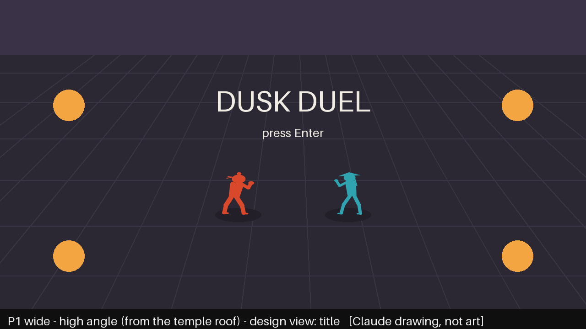
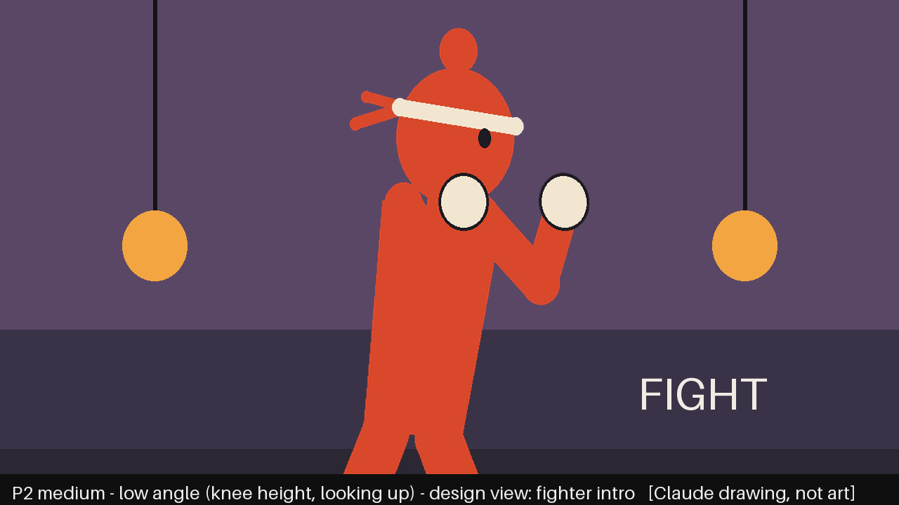
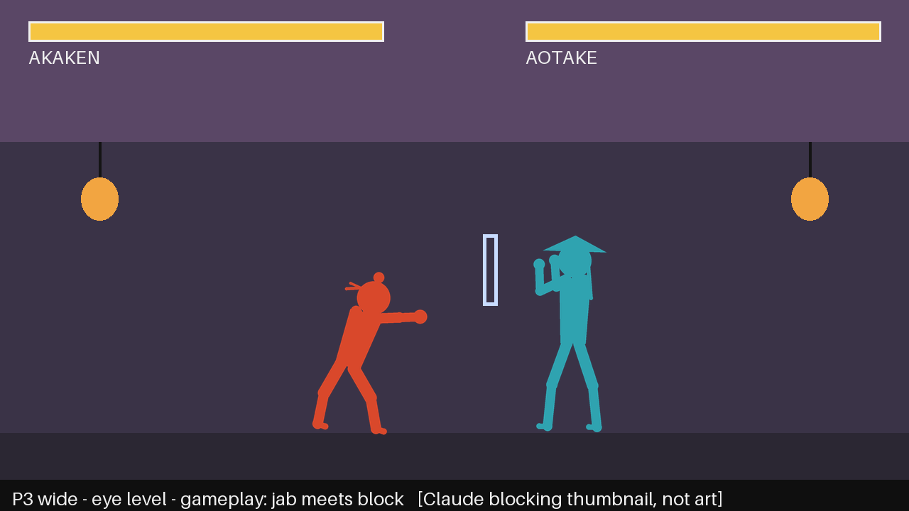
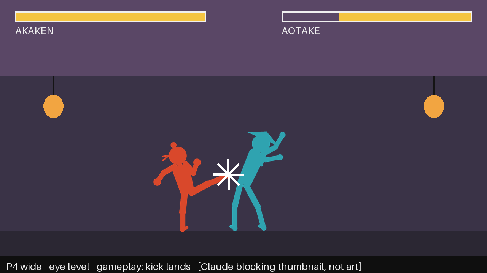
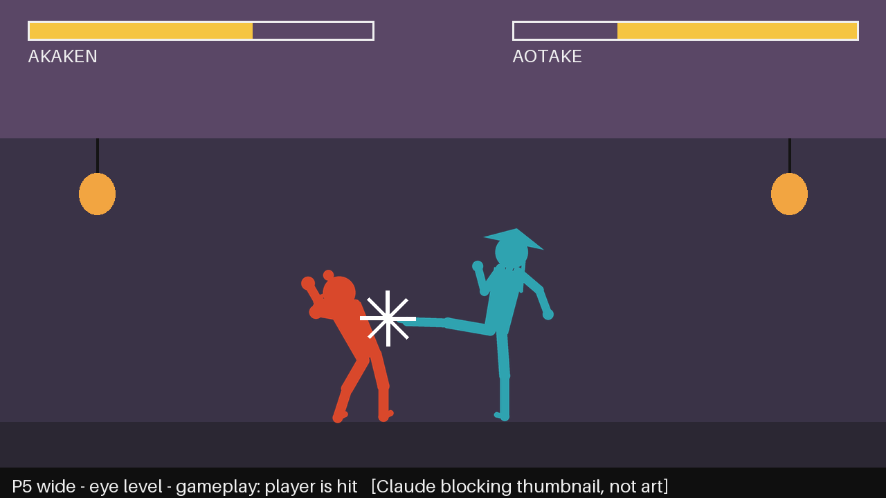
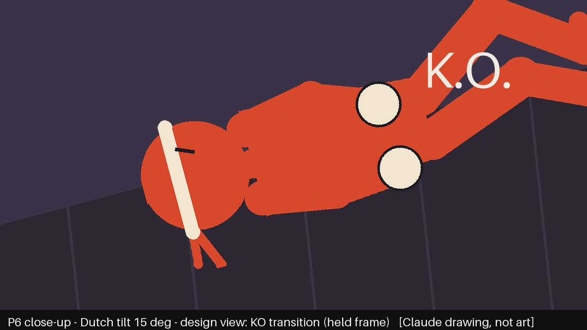
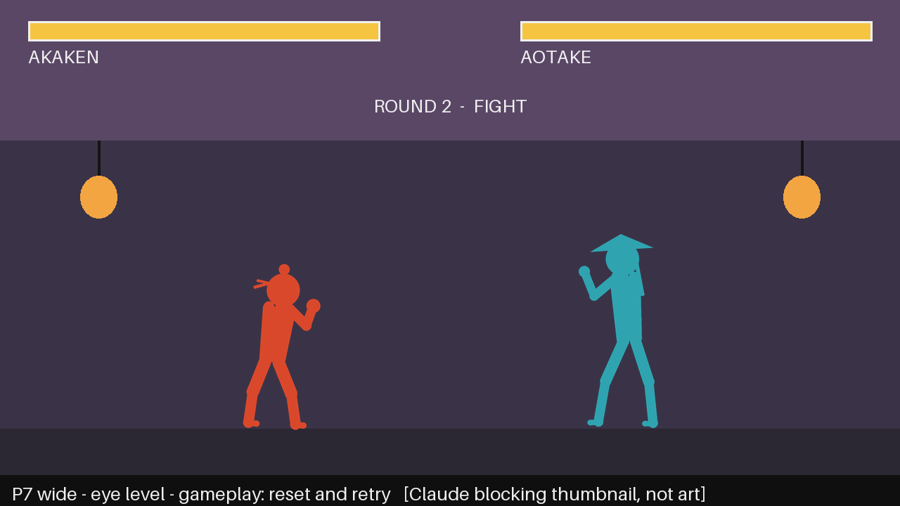
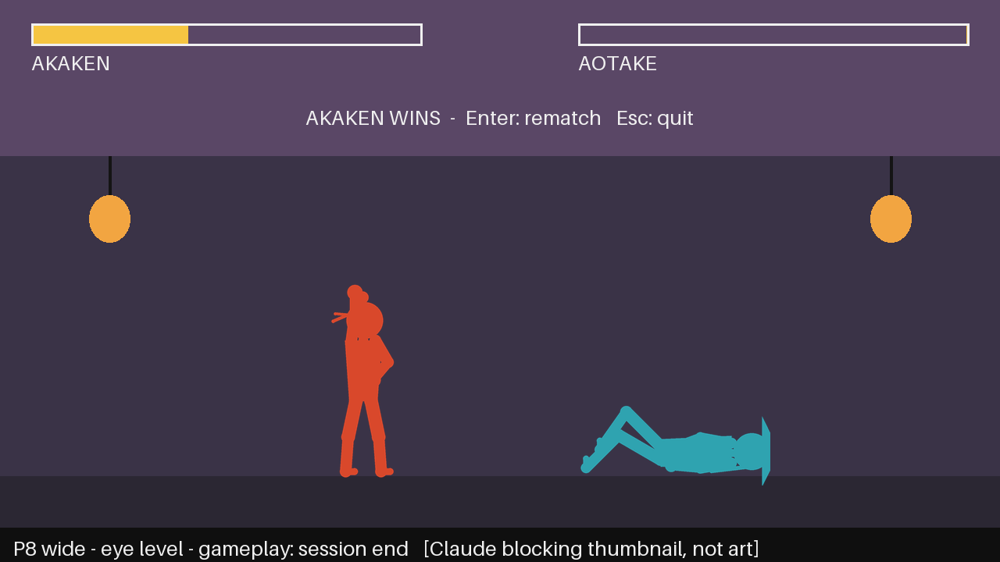

# STORYBOARD — walker-dusk-duel

> Version 1 · 2026-10-05 · written before any generation. Frame shape: **16:9** throughout.
> The gameplay camera is one fixed side view at eye level showing the whole arena.
> Gameplay panels 03, 04, 05, 07, 08 have blocking thumbnails made by `tools/make_storyboard.py`
> (Claude-written, mannequins, not art). Design-view panels 01, 02, 06 are **to be hand-sketched by
> Zhaohui** and photographed into `design/storyboard/`.

Coverage: views = wide (01, 03–05, 07, 08), medium (02), close-up (06).
Angles = high/bird's-eye (01), low (02), eye level (03–05, 07, 08), Dutch tilt (06).

## Panel 1 — Title: the courtyard at dusk
 *(to sketch)*
- Shot: wide · high angle (looking down into the courtyard from the temple roof) · design view (title screen)
- Player action: presses Enter to start; the game fades from the title card to the fight
- See: whole courtyard, lanterns on both sides, the two fighters small, facing each other; title text
- Hear: music loop starts (MUS-LOOP, playing)
- Assets: ENV-BG, CHAR-AK-IDLE, CHAR-AO-IDLE, MUS-LOOP
- Design reason (pillar *Dusk ritual*): the duel is a calm ceremony in one place, before anything happens

## Panel 2 — Fighter intro
 *(to sketch)*
- Shot: medium · low angle (camera at knee height looking up at Akaken) · design view (pre-round intro)
- Player action: none; the game holds for one second and shows "FIGHT"
- See: Akaken in idle stance, big wrapped fists toward camera, headband tails moving behind
- Hear: music playing; no SFX
- Assets: CHAR-AK-IDLE, ENV-BG, MUS-LOOP
- Design reason (*Read the opponent*): fix the player's silhouette in memory, the shape they must track all round

## Panel 3 — First exchange: jab meets block

- Shot: wide · eye level · gameplay view
- Player action: walks in and presses Punch; Aotake is holding block, so the jab is stopped
- See: CHAR-AK-PUNCH vs CHAR-AO-BLOCK, a pale block flash at the forearms, no health change
- Hear: SFX-BLOCK (a punch that misses entirely would play SFX-WHIFF instead); music playing
- Assets: CHAR-AK-WALK, CHAR-AK-PUNCH, CHAR-AO-BLOCK, ENV-BG, SFX-BLOCK, SFX-WHIFF, MUS-LOOP
- Design reason (*Read the opponent*): a blocked hit must look and sound different from a clean hit

## Panel 4 — Success: the kick lands

- Shot: wide · eye level · gameplay view
- Player action: presses Kick while Aotake is open; the hit registers once
- See: CHAR-AK-KICK, CHAR-AO-HURT leaning away from Akaken, white spark at the foot, Aotake's bar drops
- Hear: SFX-HIT once; music playing
- Assets: CHAR-AK-KICK, CHAR-AO-HURT, ENV-BG, SFX-HIT, MUS-LOOP
- Design reason (*Every hit is felt*): contact is confirmed by pose, spark, bar and sound together

## Panel 5 — Failure: the player is hit

- Shot: wide · eye level · gameplay view
- Player action: stays in range after a whiff; Aotake's front kick connects; player loses control briefly
- See: CHAR-AK-HURT leaning left, away from the kick, so the side of the hit is obvious; Akaken's bar drops
- Hear: SFX-HIT once; music playing
- Assets: CHAR-AK-HURT, CHAR-AO-KICK, ENV-BG, SFX-HIT, MUS-LOOP
- Design reason (*Read the opponent*): the player should see why: they stayed in range of the long leg

## Panel 6 — KO (loss)
 *(to sketch)*
- Shot: close-up · Dutch tilt (about 15°) · design view (KO transition, held frame)
- Player action: health reaches 0; input is ignored for 1.5 s
- See: Akaken's face and fist on the stone floor (CHAR-AK-KO), "K.O." text
- Hear: SFX-KO once; **music stops**
- Assets: CHAR-AK-KO, ENV-BG, SFX-KO
- Design reason (*Dusk ritual*): sudden silence makes the ending land without gore

## Panel 7 — Recovery: rematch

- Shot: wide · eye level · gameplay view
- Player action: presses Enter on the KO screen; both fighters reset to start positions and full health
- See: both idle stances, full bars, "ROUND 2 — FIGHT"
- Hear: music restarts from the top of the loop
- Assets: CHAR-AK-IDLE, CHAR-AO-IDLE, ENV-BG, MUS-LOOP
- Design reason (*One more round*): retry is one key press away, with no menu between

## Panel 8 — End of session: victory

- Shot: wide · eye level · gameplay view
- Player action: lands the final hit; Aotake falls; after 1 s Akaken raises a fist; Enter = rematch, Esc = quit
- See: CHAR-AK-WIN, CHAR-AO-KO, Aotake's bar empty, win text
- Hear: SFX-HIT then SFX-KO once each; **music stops** and stays stopped
- Assets: CHAR-AK-WIN, CHAR-AO-KO, ENV-BG, SFX-HIT, SFX-KO
- Design reason (*Every hit is felt*): the last hit is the loudest moment, followed by quiet
